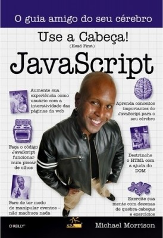
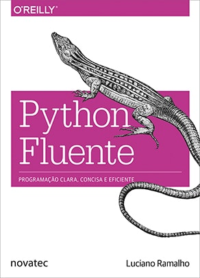

<!-- {"layout": "title"} -->
# **Programação** Web

## Plano de Ensino por **Flávio Coutinho** e **Daniel Hasan**

---
<!-- {"layout": "section-header"} -->
# Plano de Ensino

## Sumário do conteúdo

[Slides](#slides)
  ~ Conteúdo das aulas em _slides_

[Ementa](#ementa)
  ~ Objetivo e a descrição da matéria

[Bibliografia](#bibliografia)
  ~ Livros e materiais básicos e complementares

[Avaliação](#avaliacao)
  ~ O formato e os itens de distribuição dos pontos

<!-- {dl:.content} -->

---
<!-- {"slideHash": "slides", "layout": "regular"} -->
# Aulas

- [História da Web](classes/intro/)
- [HTML 1](classes/html1/) - Funcionamento da Web, Estrutura da HTML e CSS
- [HTML 2](classes/html2/) - Imagens, Tabelas e Plantas Carnívoras (Prática)
- [HTML 3](classes/html3/) - Ferramentas, Multimídia e a Cabeça (_i.e._, `head`)
- [CSS 1](classes/css1/) - Seletores e Ninjas (Prática)
- [CSS 2](classes/css2/) - Especificidade, propriedades mil, Web Fonts
- [HTML 4](classes/html4/) - Div/Span, Box Model, Float e Unicórnios (Prática)
- [CSS 3](classes/css3/) - Divitite e as _tags_ semânticas, visibilidade e _Layout_
- [CSS 4](classes/css4/) - _Layout_ e o Coral 55 (Prática)

---

# Aulas (página 2)

- [Javascript 1](classes/js1/) - Linguagem
- [Javascript 2](classes/js2/) - DOM, Eventos, o Espaço e RPG (Prática)
- [HTML 5](classes/html5/) - Formulários e Monstros (Prática)
- [Javascript 5](classes/js5/) - APIs do HTML5
- [Javascript 4](classes/js4/) - JSON e AJAX (Prática)
- [Javascript 3](classes/js3/) - Padrões de Projeto
- [Javascript 7](classes/js7/) - EcmaScript 2015/2016

---
<!--
{
  "slideHash": "ementa",
  "layout": "section-header"
}
-->
# Ementa

## Objetivos

1. Criar páginas **HTML com uso de CSS e Javascript**
1. Desenvolver **sistemas web dinâmicos** com banco de dados e Framework Django (Python)
1. Fazer trabalhos práticos legais
1. Tornar-se um **ninja** Javascript

<!-- {ol:.content} -->

---
<!--
{
  "slideHash": "bibliografia",
  "layout": "section-header"
}
-->
# Bibliografia

## Os textos e materiais que vamos usar

Veja a bibliografia básica e a complementar.

<!-- {p:.content} -->
---
<!-- { "styles": ["styles/classes/books.min.css"] } -->
## **Livro texto** da parte 1

::: figure .book
-  <!-- {.full-width.full-height} -->
- .
<!-- {ul:.hardcover_front} -->
- .
- [Sobre](http://headfirstlabs.com/books/hfhtml/) <!-- {a:.book-btn target="_blank"} -->
- .
- .
- .
<!-- {ul:.page} -->
- .
- .
<!-- {ul:.hardcover_back} -->
- .
- .
<!-- {ul:.book_spine} -->
:::

**Título**
	 ~ Head First HTML and CSS, Second Edition

**Autores**
	 ~ Elisabeth Robson, ~~Gordon~~ Eric Freeman

**Editora**
   ~ O'Reilly Media, 2012
---
## **Livro texto** sobre JavaScript

<!-- { "styles": ["styles/classes/books.min.css"] } -->
## **Livro texto** da parte 1

::: figure .book
-  <!-- {.full-width.full-height} -->
- .
<!-- {ul:.hardcover_front} -->
- .
- [Sobre](http://www.altabooks.com.br/use-a-cabeca-programacao-javascript.html) <!-- {a:.book-btn target="_blank"} -->
- .
- .
- .
<!-- {ul:.page} -->
- .
- .
<!-- {ul:.hardcover_back} -->
- .
- .
<!-- {ul:.book_spine} -->
:::

   **Título**
     ~ Use a Cabeça: Programação JavaScript, 1ª edição

   **Autor**
     ~ Eric Freeman

   **Editora**
     ~ O'Reilly Media, 2016 (tradução)

---
## **Livro texto** sobre Python
## **Livro texto** da parte 2

<!-- { "styles": ["styles/classes/books.min.css"] } -->
::: figure .book
-  <!-- {.full-width.full-height} -->
- .
<!-- {ul:.hardcover_front} -->
- .
- [Sobre](https://novatec.com.br/livros/pythonfluente/) <!-- {a:.book-btn target="_blank"} -->
- .
- .
- .
<!-- {ul:.page} -->
- .
- .
<!-- {ul:.hardcover_back} -->
- .
- .
<!-- {ul:.book_spine} -->
:::

**Título**
  ~ Python Fluente

**Autor**
  ~ Luciano Ramalho

**Editora**
  ~ Novatec
---

# Bibliografia Complementar

---
## Dive into HTML5

  
  

- [Online](http://diveintohtml5.com.br/), gratuito

---
## JavaScript: The Good Parts

  
  

- **Título**	JavaScript, the Good Parts, First Edition
- **Autor**	Douglas Crockford
- **Editora** O'Reilly Media, 2008

---
## Head First HTML5 Programming

  
  

- **Título**	Head First HTML5 Programming
- **Autores**	~~Gordon~~ Eric Freeman, Elisabeth Robson
- **Editora** O'Reilly Media, 2011

---
<!--
{
  "slideHash": "avaliacao",
  "layout": "section-header"
}
-->
# Avaliação

## Distribuição de pontos

- ~8 Atividades (parte 1): **20** pontos
- ~5 Atividades (parte 2): **22** pontos
- 1 Seminário: **15** pontos
- Trabalhos Práticos:
  - TP 1: **18** pontos
  - TP 2: **25** pontos

<!-- {ul^1:.content} -->

<!---
# Trabalhos (60 pontos)

- [TP0: Git][tp0] (3 pontos)
- [Projeto][project] (45 pontos)
  - Entrega 1: (20 pontos, data: 26/04/2018)
  - Entrega 2: (25 pontos)
    - Código pronto e publicado (data: TBD)
    - Apresentação (data: TBD, em sala)
- [Seminário: APIs HTML5][seminar] (20 pontos, data: TBD)

*[TBD]: to be defined*

[tp0]: assignments/tp0
[project]: https://github.com/fegemo/cefet-web/tree/master/assignments/project-craftfoliogotchi/README.md
[seminar]: https://github.com/fegemo/cefet-web/tree/master/assignments/seminar-html5/README.md
-->
