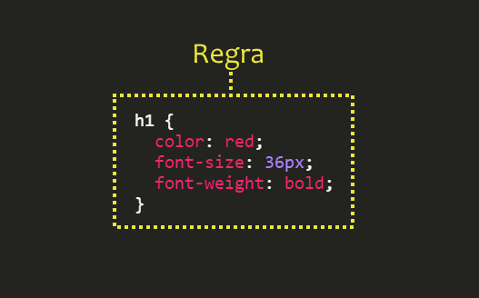
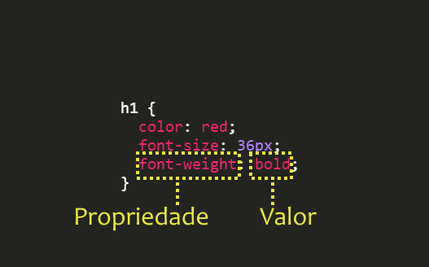

# CSS - Parte 1

---
# Roteiro de hoje

1. História
1. A sintaxe
1. Classes e IDs
1. A cascata
1. Seletores
1. **Os Ninjas**

---
## História

1989 - 1993 <!-- {.bullet-old} -->
  ~ Tim Berners-Lee cria a WWW em CERN
    (_European Organization for Nuclear Research_) e a deixa aberta ao público
    geral <!-- {dd:.bullet-old} -->

1994
  ~ ::: figure .floating-portrait-container.push-right
    
    :::
    Håkon propõe uma linguagem para dar conta da responsabilidade
    de alterar a aparência de páginas web chamada CSS

1996
  ~ Juntamente com Bert Bos, Håkon publica a especificação do
    **CSS1**

1998
  ~ Já gerenciado pela W3C, a especificação do **CSS2** foi
  publicada

1998 - 2014
  ~ Desenvolvimento da especificação do **CSS3** (_living standard_)

2013
  ~ Håkon tornou-se CTO na _Opera Software_

---
# Recapitulando a **sintaxe**

---
## Sintaxe: **regra**



---
## Sintaxe: **seletor** e **declaração**


---
## Sintaxe: **propriedade** e **valor**



---
## Problema: **selecionando** elementos

- Como fazemos para selecionar (_e.g._):
  1. apenas **alguns parágrafos** em vez de todos?
  1. apenas o **primeiro título h2** da página?
  1. apenas **uma imagem em especial**?
- Uma solução possível é usar os atributos universais¹ HTML chamados
  **`class`** e **`id`** para identificar os elementos e estilizá-los
  - ¹: atributos que qualquer elemento pode ter

---
# Classes e IDs
---
## Classe

- Até agora, estilizamos elementos `html` da seguinte forma:
  ```css
  p {
    color: blue;
  }
  ```
  - Isso faz com que **todos** os parágrafos sejam estilizados com a cor azul
  - Como fazemos, então, para estilizar apenas um ou um subconjunto de
    parágrafos da forma como queremos?
    - Resposta: usando **classes**

---
## Classe (cont.)

- Dada a seguinte estrutura de um &lt;body&gt;&lt;/body&gt;:
  ```html
  <p>Primeiro</p>
  <p>Segundo</p>
  <p>Terceiro</p>
  ```
- Para criar uma regra `CSS` para, digamos, os dois primeiros parágrafos, podemos
  alterar a estrutura `html` para:
  ```html
  <p class="destacado">Primeiro</p>
  <p class="destacado">Segundo</p>
  <p>Terceiro</p>
  ```
- continua...

---
## Classe (cont.)

- E, em um arquivo `CSS`, podemos escrever o nome da _tag_, seguido por um ponto
   "`.`", seguido pelo nome da classe:
  ```css
  p.destacado {
    font-weight: bold; /* negrito */
  }
  ```
- Ou, se quisermos usar a classe `destacado` para outros elementos que não
  `<p></p>`, podemos omitir o nome da _tag_:
  ```css
  .destacado {
    font-weight: bold;
  }
  ```

---
## Atributo Universal **ID**

- Caso soubermos que um elemento deve aparecer apenas uma vez no arquivo `html`
  (por exemplo, o menu principal, o logotipo etc.), podemos usar **um
  identificador único** que chamamos de **id**
  ```html
  
  ```
- Para criar uma regra `CSS` para esse elemento, podemos utilizar seu id
  precedido por `#`, opcionalmente precedido pelo nome da _tag_:
  ```css
  #logotipo {
    width: 250px;
  }
  ```

---
# A Cascata

---
<!-- {"layout": "regular"} -->
## A **Cascata**

- CSS é a sigla para _**Cascading** Style Sheets_
- Algumas propriedades são **herdadas** dos elementos ascendentes
  ```css
  body {
    color: #ff0000; /* mesmo que 'red' */
  }
  ```
  - Todo o texto que estiver dentro de `<body>...</body>`, mesmo que dentro de
    parágrafos ou outros elementos, ficarão vermelhos

---
<!-- {"layout": "regular"} -->
## Exemplo da Cascata

<iframe width="100%" height="300" src="//jsfiddle.net/fegemo/gqgacz36/embedded/result,html,css/" allowfullscreen="allowfullscreen" frameborder="0"></iframe>

- Nota: clique nas abas "HTML", "CSS" e "Result". Para editar o código, clique
  em "Edit in JSFiddle"

---
<!-- {"layout": "regular"} -->
## Cascata (cont.)

- Para as propriedades que não são herdadas por padrão (_e.g._, `border`),
  podemos forçar que sejam herdadas usando o valor `inherit`:
  ```css
  p {
    border: 1px solid red;
  }
  em {
    border: inherit;
  }
  ```
  ::: result
  <p style="border: 1px solid red;">Este é um <em style="border: inherit">parágrafo</em> (&lt;em&gt; em 'parágrafo')</p>
  :::

---
<!-- {"layout": "regular"} -->
## Cascata (cont.)

- Também podemos sobrescrever a herança de uma propriedade:
  ```css
  body {
    font-weight: bold;
  }
  em {
    font-weight: normal;  /* ou, então, font-weight: initial */
  }                       /* initial é o valor padrão para aquela tag */
  ```
  ::: result
  <p style="font-weight: bold;">Este é um <em style="font-weight: normal">parágrafo</em> (&lt;em&gt; em 'parágrafo')</p>
  :::

---

## Outros seletores...

---
<!-- {"layout": "regular", "slideHash": "outros-seletores"} -->
## Seletores

-  <!-- {.push-right} -->
  Até agora, já sabemos **selecionar elementos de <u>03 formas</u>**:
  1. Pelo **nome de sua _tag_**: `p { color: white; }`
  1. Por (uma de) suas **classes**: `.spam { color: red;}`
  1. Por seu **id**: `#manchete-principal { color: green; }`
- Contudo, a vida não para por aí...
  - Há 20+ tipos de seletores (dos quais já vimos 3)
  - Não é necessário decorar todos, apenas saber que existem para poder
    consultá-los (Google) depois ;)

---
<!-- {"layout": "regular"} -->
## Desafio #1

> Colorir de laranja **apenas os <u>links dentro da lista</u> não ordenada**:
>  <!-- {.centered} -->

- Poderíamos usar uma classe (`.marca-de-sabao`) nos links da lista
  - Mas há uma forma melhor!
  - É possível **fazer isso sem alterar o HTML**! <!-- {li:.bullet} -->
    - ```css
      ul a {  /* todo <a> dentro de uma <ul> */
        color: orange;
      }
      ```
      <!-- {ul^0:.bullet.no-list-icon.layout-split-2} -->
    - :::result
      - Sabão [Omo](http://omo.com.br) <!-- {style="color: orange"} -->
      - Sabão [Ariel](http://ariel.com.br) <!-- {style="color: orange"} -->

      [Voltar para cima](#) <!-- {style="color: blue"} -->
      :::

---
<!-- {"layout": "regular"} -->
## Seletores de **Descendente** e **Filho direto**

- Formato: `X Y` _(antecessor, espaço, elemento selecionado)_ <!-- {ul:.layout-split-2.no-padding.no-list-icon.flex-equal-children} -->
  - Exemplo:
    ```css
    ul a {
      text-decoration: none;
    }
    ```
    - Descrição: seleciona todos hiperlinks `a` que têm um `ul` como
      antecedente (pai, avô, bisavô etc.)
- Formato: `X > Y` _(pai, sinal de maior, elemento selecionado)_
  - Exemplo:
    ```css
    #menu-principal > ul {
      padding: 20px;
    }
    ```
    - Descrição: seleciona todos os `ul` que têm `#menu-principal` como pai

---
<!-- {"layout": "regular"} -->
## Exemplo: **Descendente** vs **Filho direto**

- ```html
  <p>
    <strong>Ola! <a href="http://www.google.com">Este é meu link! </a></strong>
    <a href="http://www.terra.com.br">Esta é uma outra pagina</a>
  </p>
  <a href="http://google.com">Este é outro link</a>
  ```
- &nbsp;
  - ```css
    p > a { /* <a>s filhos de um <p> */
      text-decoration: line-through;
    }
    p a { /* <a>s descendentes de um <p> */
      color: red;
    }
    ```
  - :::result
    <p>
      <strong style="color:black;">Ola! <a style="color:red;" href="http://www.google.com">Este é meu link! </a></strong>
      <a style="color:red;text-decoration: line-through;" href="http://www.terra.com.br">Esta é uma outra pagina</a>
    </p>
    <a style="color:blue" href="http://google.com">Este é outro link</a>
    :::

    <!-- {ul^0:.no-list-icon.no-padding.layout-split-2}-->
    <!-- {ul^1:.no-list-icon.no-padding}-->

---
<!-- {"layout": "regular", "slideHash": "desafio-seletor-atributo"} -->
## Desafio #2

> Colocar uma borda rosa **apenas nas imagens .jpg**:
> 

- Poderíamos usar uma classe (`.formato-jpg`) nessas imagens...
  - Mas há uma forma melhor!
  - É possível **selecionar elementos de acordo com seus atributos**! <!-- {li:.bullet} -->
    - ```css
      img[src$=".jpg"] {
        border: 5px solid hotpink;
      }
      ```
      <!-- {li:.bullet} -->

---
<!-- {"layout": "regular"} -->
## Seletores de **Atributo**

- Podemos selecionar elementos HTML **de acordo com <u>seus atributos</u>**:
  - ```css
    a[href] {
      color: blue;  /* [a] */
    }
    a[href="http://google.com"] {
      color: blue;  /* [b] */
    }
    a[href^="http"] {
      color: blue;  /* [c] */
    }
    a[href$=".com"] {
      color: blue;  /* [d] */
    }
    a[href*="google"] {
      color: blue;  /* [e] */
    }
    ```
  - Há **5 variações**: <!-- {li:style="margin-left: 1em"} -->
    - [a] existência do atributo: `[atributo]` <!-- {li:.push-code-right} -->
      - Neste caso, todo `<a>` que possua `href`
    - [b] valor inteiro: `[atrib="valor"]` <!-- {li:.push-code-right} -->
    - [c] começo do valor: `[atrib^="inicio"]` <!-- {li:.push-code-right} -->
    - [d] fim do valor: `[atrib$="final"]` <!-- {li:.push-code-right} -->
    - [e] trecho do valor: `[atrib*="trecho"]` <!-- {li:.push-code-right} -->
    - Repare que esses seletores podem ser **usados com qualquer elemento**:
      ```css
      img[alt] {
        border: 5px solid red;
      }
      ```
    <!-- {ul^2:.layout-split-2.no-list-icon.no-padding.compact-code} -->

---
<!-- {"layout": "regular"} -->
## Exemplos de seletores de atributos

```css
a[href$=".br"] {
  background-image: linear-gradient(45deg, green, yellow);
}
img[alt*="ninja"] {
  border: 3px solid black;
}
a[href^="http"] {
  color: purple;
}
```

```html


<a href="http://www.terra.com.br">Um site brasuca<a>
<a href="http://www.cnn.com">Um site gringo<a>
```

:::result . margin: 1em auto;


<a style="color:purple;background-image: linear-gradient(45deg, green, yellow);" href="http://www.terra.com.br">Um site brasuca<a>
<a style="color:purple;" href="http://www.cnn.com">Um site gringo<a>
:::

---
<!-- {"layout": "regular", "slideHash": "desafio-seletor-estado"} -->
## Desafio #3

> Tirar o sublinhado do hyperlink **quando passar o mouse sobre ele**:
> 

- A única forma de fazer é usando **seletores de estado**: <!-- {li:.bullet} -->
  - ```css
    a:hover {
      text-decoration: none;
    }
    ```
    <!-- {li:.bullet} -->

---
<!-- {"layout": "regular", "embeddedStyles": ".link:link {color: blue; text-decoration: underline;}.link:hover {color: cyan;}.link:active {color: gold;}"} -->
## Seletores de **Estado**

- Podemos selecionar elementos HTML **de acordo com <u>seus atributos</u>**:
  - ```css
    a:link {
      color: blue;  /* [a] */
    }
    a:hover {
      color: cyan;  /* [b] */
    }
    a:active {
      color: gold;  /* [c] */
    }
    ```
    ::: result
    [Um link](#um-link) <!-- {a:.link} -->
    :::
  - Há pelo menos **3 estados**: <!-- {li:style="margin-left: 1em"} -->
    - [a] situação inicial `:link`
    - [b] mouse em cima: `:hover`
    - [c] começo do valor: `:active`
    - Repare que os seletores `:hover` e `:active` podem ser **usados com outros elementos**:
      ```css
      tr {
        background-color: white;
      }
      tr:hover {
        background-color: silver;
      }
      ```
    <!-- {ul^1:.layout-split-2.no-list-icon.no-padding.compact-code} -->

---
<!-- {"layout": "regular", "slideHash": "desafio-seletor-negacao"} -->
## Desafio #4

> Centralizar todas imagens **exceto uma ou outra**:
> 

- Isso poderia ser feito colocando classes/ids nos elementos <!-- {li:.bullet} -->
  - Mas há outra forma, com o **seletor de negação**:
    ```css
    img:not(#logo) {
      display: block;
      margin: 0 auto; /* vertical: 0, horizontal: auto */
    }
    ```
    <!-- {li:.bullet} -->

---
<!-- {"layout": "regular"} -->
## Seletor: **Negação**

- Formato: `X:not(seletor)`
- Exemplo:
  ```css
  p:not(.destacado) {
    color: gray;
  }
  ```
- Descrição: seleciona todos os elementos que **não passem pelo teste** do
  `seletor`
  - Ou seja, no exemplo, seleciona todos os **`<p>` que
    não possuam a classe `.destacado`**

---
<!-- {"layout": "regular-block", "embeddedStyles": ".tabela tr:nth-child(2n){background:lightblue;}.tabela tr:nth-child(2n+1){background:silver;}"} -->
## Outros seletores

::: did-you-know .push-right width: 360px; margin-left: 6px;
A parte dso seletores "com dois pontos" (eg, `:not()`, `:hover`) é chamada
de **pseudoclasse**. Veja [todas aqui](https://developer.mozilla.org/pt-BR/docs/Web/CSS/Pseudo-classes).
:::

- Seletores **de posição** dentro do pai:
  - `X:first-child`
  - `X:last-child`
  - `X:nth-child(n)` <!-- {ul^0:.multi-column-list-2}-->
- Seletores **de posição** de um tipo:
  - `X:first-of-type`
  - `X:last-of-type`
  - `X:nth-of-type(n)` <!-- {ul^0:.multi-column-list-2}-->
- Exemplo de `nth-child`:
  - ```html
    <table>
      <tr><td>Linha 1</td></tr>
      <tr><td>Linha 2</td></tr>
      <tr><td>Linha 3</td></tr>
      <tr><td>Linha 4</td></tr>
    </table>
    ```
  - ```css
    tr:nth-child(2n) { /*par*/
      background: lightblue;
    }
    tr:nth-child(2n+1) {
      background: silver;
    }
    ```
  - ::: result
    <table class="tabela">
      <tr><td>Linha 1</td></tr>
      <tr><td>Linha 2</td></tr>
      <tr><td>Linha 3</td></tr>
      <tr><td>Linha 4</td></tr>
    </table>
    :::
    <!-- {ul^0:.layout-split-3.no-list-icon.no-padding style="justify-content:space-between;"}-->

[css-selectors-30]: https://code.tutsplus.com/pt/tutorials/the-30-css-selectors-you-must-memorize--net-16048
---
# Exercícios

- Escreva uma (única) regra em CSS para colorir de vermelho apenas links que estejam dentro de tabelas. Os demais links deverão continuar da mesma forma.
- Faça um seletor para adicionar uma borda preta de 1 pixel e sólida em cada uma das situações/elementos abaixo:
  - Todos os parágrafos dentro de um elemento cujo id é `andorinha`
  - Paragrafos que são filhos diretos do elemento cujo id é `andorinha`
  - Qualquer célula de tabela que possua um rowspan
```css
   ???{
     border: 1px solid black;
   }
```  
---
<!-- {"layout": "section-header", "slideHash": "os-ninjas"} -->
# Os Ninjas :dash:
## Conheça essa gente ligeira

- Atividade de hoje
---
## Atividade de Hoje

1. Instalar o git na máquina, caso ele não esteja instalado
1. **Criar um _fork_** do repositório do professor em [`https://github.com/daniel-hasan/cefet-web-ninjas`](https://github.com/daniel-hasan/cefet-web-ninjas)
  e **cloná-lo para sua área de trabalho**
1. Fazer o exercício e fazer _commits_ e _push_ no seu repositório
1. Enviar, via **SIGAA**, o link do seu repositório até o final da aula

<!-- {ul:.content} -->
---
## Atividade de Hoje


1. Você deve estilizar as duas páginas web dos ninjas usando os
   conhecimentos que vimos nas aulas anteriores
1. Lembre-se das boas práticas - use CSS em arquivo externo
1. Você pode modificar o HTML das páginas para colocar `class` e `id` nos
   elementos para os quais essa alteração seja necessária
   - Mas considere **usar os seletores <u>mais apropriados</u>**
1. Siga os passos descritos no [arquivo README.md do exercício](https://github.com/fegemo/cefet-front-end-ninjas/blob/master/README.md)
---
# Referências

1. Capítulo 7 do livro
1. [Os 30 seletores CSS que você precisa memorizar (inglês)][css-selectors-30]

[css-selectors-30]: http://code.tutsplus.com/tutorials/the-30-css-selectors-you-must-memorize--net-16048
[Print a Book in CSS]: http://alistapart.com/article/boom
