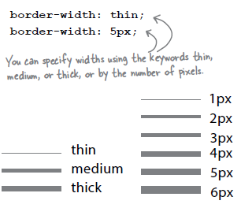
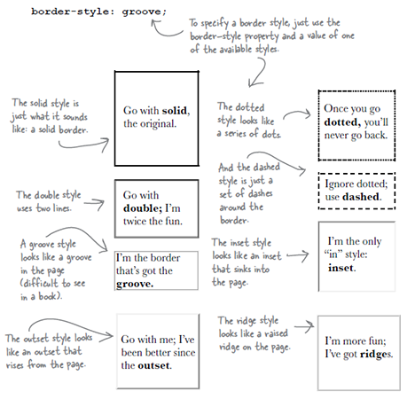
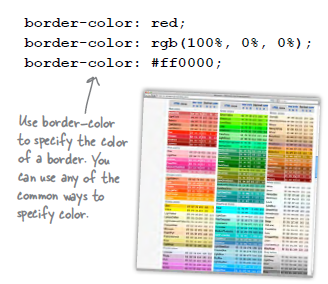

# CSS - Parte 2

---
# Roteiro de hoje

1. **Especificidade** de seletores
1. Família de propriedades: **background-***
1. Família de propriedades: **border-***
1. Cores e Gradientes
1. Família de propriedades: **text-***
1. Família de propriedades: **font-***
1. Fontes personalizadas
1. Projeto: Entrega 1

---
# Especificidade de seletores

---
## Motivação

- Dadas mais de uma regra `CSS` para um elemento, qual prevalece?
  - Como determinar qual a cor do elemento?
    ```html
    <style>
      .destaque { color: red; }
      #titulo   { color: green; }
      h1        { color: blue; }
    </style>

    <h1 id="titulo" class="destaque">Ford Prefect</h1>
    ```
---
## Regras gerais de especificidade

<dl>
  <dt>Regra 1</dt><dd>Cada seletor tem uma **pontuação de especificidade**</dd>
  <dt>Regra 2</dt><dd>Se dois seletores selecionam o mesmo elemento, mas com pontuações diferentes, ganha aquele com pontuação maior</dd>
  <dt>Regra 3</dt><dd>Se dois seletores selecionam o mesmo elemento e têm a mesma pontuação, ganha o que foi declarado por último</dd>
  <dt>Regra 4</dt><dd>Estilo Inline &gt;&gt; Arquivo Externo &gt;&gt; Incorporado</dd>
  <dt>Regra 5</dt><dd>ID &gt;&gt; classe &gt;&gt; atributo &gt;&gt; tag</dd>
</dl>

---
## Cálculo da **pontuação de especificidade**

- [Recomendação na W3C sobre _CSS3 Selectors_](http://www.w3.org/TR/css3-selectors/#specificity)
- Algoritmo
  1. Contar o número de IDs no seletor (variável `a`)
  1. Contar o número de classes, atributos e pseudo-classes no seletor (`b`)
  1. Contar o número de tags e pseudo-elementos no seletor (`c`)
  1. Concatenar os três números (`abc`)

---
## Exemplos

```css
/* seletor { propriedades }  abc */
li { }                    /* 001 */
.destaque { }             /* 010 */
li.destaque { }           /* 011 */

#rodape { }               /* 100 */
#rodape #logo { }         /* 200 */

a[href^="www"] { }        /* 011 */
p strong em { }           /* 003 */
```

---
## Exercício

- Qual é a cor do texto?
  ```html
  <style>
    #a .b .c { color: red; }
    .d .e .f { color: green; }
    .g .h #i { color: blue; }
  </style>
  <p id="a" class="d g">
      <strong class="b e h">
          <em id="i" class="c f">Qual é a minha cor?</em>
      </strong>
  </p>
  ```
  - [Questionário Maroto](https://moodle.cefetmg.br/mod/quiz/view.php?id=17987) e [Resposta](https://jsfiddle.net/fegemo/bw1xt1az/) no JSFiddle

---
<!--
  scripts: [../../scripts/classes/spec-tabajara.min.js]
  styles: [../../styles/classes/spec-tabajara.min.css]
-->

## **Specificator Tabajara**

<article id="specTabajara">
  <div>
    <input type="text" id="specTabajaraInput" placeholder="seletor...">
  </div>
  <div>
    <button id="specTabajaraButton">Calcular</button>
  </div>
  <div>
    <div class="specClass">
      <div id="specTabajaraOutputA" class="specOutput">0</div>
      <div>A IDs</div>
    </div>
    <div class="specClass">
      <div id="specTabajaraOutputB" class="specOutput">0</div>
      <div>Classes, atributos e pseudo-classes</div>
    </div>
    <div class="specClass">
      <div id="specTabajaraOutputC" class="specOutput">0</div>
      <div>Elementos, pseudo-elementos</div>
    </div>
  </div>
</article>

---
# Propriedade **background**

---
## **background**

- Usada para definir o preechimento do fundo de uma caixa (_box model_)
- A propriedade `background ` é um atalho para
  - `background-clip, background-color, background-image, background-origin,
    background-position, background-repeat, background-size` e
    `background-attachment.`

---
## **`background-color`**

- Define uma cor de fundo
  ```css
  div { background-color: #ff00f0; }
  ```
  ```html
  <div>Conteúdo</div>
  ```
- Resultado:
  <div style="background-color: #ff00f0;">
    Conteúdo
  </div>

---
## **`background-image`**

- Define uma imagem de fundo
  ```css
  div { background-image: url(images/bells.png); }
  ```
- Resultado:
  <div style="background-image: url(../../images/bells.png);">
    Conteúdo
  </div>

---
## **`background-repeat`**

- Define se e como a imagem de fundo deve ser repetida
  ```css
  div {
    background-image: url(images/bells.png);
    background-repeat: no-repeat;
    padding-left: 40px;
  }
  ```
- Resultado:
  <div style="background-image: url(../../images/bells.png); background-repeat: no-repeat; padding-left: 40px;">
    Conteúdo
  </div>

---
## **`background-position`**

- Define a posição de onde deve começar a(s) imagem(ns) definida(s) em
  `background-image`
  ```css
  div {
    background-image: url(images/bells.png);
    background-repeat: no-repeat;
    background-position: 100% 0%;
  }
  ```
- Resultado:
  <div style="background-image: url(../../images/bells.png); background-repeat: no-repeat; background-position: 100% 0%;">
    Conteúdo
  </div>

---
## Outras propriedades background-*

- `background-clip`
  - Define, em termos da caixa (_box model_), até onde o `background` será
    pintado
  - Valores: `content-box`, `padding-box` (padrão) ou `border-box`
- `background-origin`
  - Define o significado do início (0%, 0%) dos valores dados à propriedade
    `background-position`
- `background-attachment`
  - Define se a(s) imagem(ns) definida(s) por `background` devem seguir a
    rolagem da página (`scroll`) ou se deve se manter fixo (`fixed`)

---
# Propriedade **border**

---
## **border**

- Usada para definir a borda da caixa (_box model_) de um elemento
- A propriedade `border` é um atalho para `border-width`, `border-style` e
  `border-color`
  - Exemplo:
    ```css
    p {
      border: 1px solid red;
    }
    ```
    ```css
    .retrato {
      border-width: 1px;
      border-style: solid;
      border-color: red;      
    }
    ```

---
## `border-width`



---
## `border-style`



---
## `border-color`



---
## Especificando **propriedades para cada lado**


---
## Especificando **cantos arredondados**


---
# Cores e gradientes

---
## Cor

- Em `CSS`, existe um [tipo de dados `color`](https://developer.mozilla.org/en-US/docs/Web/CSS/color_value)
- Um valor de `color` pode ser dado por:
  - uma palavra-chave
  - um valor do espaço cúbico RGB (em hexadecimal, `rgb()` ou `rgba()`)
  - um valor do espaço cilíndrico HSL (`hsl()` ou `hsla()`)

---
## Cor (cont.)

- Exemplos de cores:
  ```css
  #ff0033
  #F03                      /* Mesmo que anterior */
  rgb(255, 0, 51)
  rgb(100%, 0%, 20%)
  hsl(60, 100%,50%)
  rgba(255,0,0,0.1)         /* 10% opaque red */  
  hsla(240,100%,50%,0.05)   /* 5% opaque blue */
  rebeccapurple             /* !!! CSS4 */
  ```
  <div style="font-size: 1.5em; color: #663399; font-family: Calligraffitti, cursive">Rebecca Purple</div>

---
## Gradientes

- Assim como `color`,
  [`gradient`](https://developer.mozilla.org/en-US/docs/Web/CSS/gradient) é
  um tipo de dados em CSS
  - **Herda de [`image`](https://developer.mozilla.org/en-US/docs/Web/CSS/image)**,
    não de `color`
    - Ou seja, `linear-gradient` é um **valor válido para `background-image`**,
      e não para `background-color`
- Podemos definir um gradiente (degradê) linear usando dois valores
  - ```css
    linear-gradient( 45deg, blue, red );
    linear-gradient( to left top, blue, red);
    linear-gradient( 0deg, blue, white 20%, red ); /* exemplo */
    ```
- <div style="background-image: linear-gradient(90deg, blue, white 20%, red)">
    Conteúdo
  </div>
  ```css
  li { background-image: linear-gradient(90deg, blue, white 20%, red); }
  ```


---
# Propriedades **text-***

---
## [text-decoration](https://developer.mozilla.org/en-US/docs/Web/CSS/text-decoration)

- Aplica sublinhado, tachado, linha sobre o texto ou remove efeitos
  ```css
  a {
    text-decoration: none;    /* underline, overline, line-through */
  }
  ```
- Uma combinação pode ser usada também
  `text-decoration: underline overline`

---
## [text-align](https://developer.mozilla.org/en-US/docs/Web/CSS/text-align)

- Alinha o texto (e conteúdo) à esquerda, à direita ou justificado
  ```css
  p {
    text-align: justify;      /* left, right */
  }
  ```

---
## [text-overflow](https://developer.mozilla.org/en-US/docs/Web/CSS/text-overflow)

- Muda a visibilidade do texto que não cabe no seu _container_
  ```css
  li {
    text-overflow: ellipsis;  /* clip */
  }
  ```
- Exemplo
  - `clip`: <div style="white-space: nowrap; width: 134px; overflow: hidden">Este texto foi</div>
  - `ellispsis`: <div style="white-space: nowrap; width: 134px; overflow: hidden; text-overflow: ellipsis">Este texto foi</div>

---
## [text-transform](https://developer.mozilla.org/en-US/docs/Web/CSS/text-transform)

- Altera o _casing_ (maiúsculas vs minúsculas) de um texto
  ```css
  h1 {
    text-transform: uppercase;   /* none, capitalize, lowercase */
  }
  ```

---
## Outras

- `text-indent`
- `text-justify`
- `text-shadow`

---
# Propriedades **font-***

---
## [font-family](https://developer.mozilla.org/en-US/docs/Web/CSS/font-family)

- 
  Altera a tipografia do texto para a fonte especificada
  ```css
  body {
    font-family: Verdana, Arial, sans-serif;
  }
  ```
- Especificando fontes separadas por vírgula, utiliza-se a primeira que for
  encontrada
- Apenas algumas fontes estão instaladas no computador

---
## [font-size](https://developer.mozilla.org/en-US/docs/Web/CSS/font-size)

- Altera a altura de uma linha de texto da fonte
  ```css
  body {
    font-size: 14px;
  }
  ```
- [Unidades de medida na MDN](https://developer.mozilla.org/en-US/docs/Web/CSS/length)
  - `px`
  - `em` - Largura da letra `M`
  - `rem` - Largura da letra `M` do elemento raiz (`html`)
    - Suporte: >= IE9

---
## [font-weight](https://developer.mozilla.org/en-US/docs/Web/CSS/font-weight)


- 
  Altera o "peso" ou a grossura do traço da fonte
  ```css
  body {
    font-weight: bold;
  }
  ```

---
## [font-style](https://developer.mozilla.org/en-US/docs/Web/CSS/font-style)

- Altera a inclinação para a direita da fonte
  ```css
  body {
    font-style: italic; /* oblique, normal */
  }
  ```

---
## Outras

- `font-kerning`
- `font-stretch`
- `font-variant`

---
# Web Fonts

---
## Web Fonts

- Motivação
  - Utilizar fontes que não estão instaladas no computador dos clientes
- Passos
  1. Escolher a fonte
  1. Gerar todos os formatos para que funcione em todos os principais
     navegadores
     - `.ttf`
     - `.otf`
     - `.eot`
     - `.woff`
  1. Publicar a fonte na Internet (ou no seu próprio site)

---
## Web Fonts (cont.)

  1. Descrever a fonte no seu arquivo `CSS`
     ```css
     @font-face {
       font-family: "Emblema One";
       src: url("fonts/EmblemaOne-Regular.woff"),
            url("fonts/EmblemaOne-Regular.ttf");
     }
     ```
  1. Usar a fonte
     ```css
    h1 {
      font-family: "Emblema One", sans-serif;
    }
    ```

---
# Referências

- Capítulo 8 do livro
- [keeganstreet/specificity](https://github.com/keeganstreet/specificity)
  - O código por trás do Specificator Tabajara
- [Google Fonts](https://www.google.com/fonts)
- [CSS Zen Garden](http://www.csszengarden.com/)
