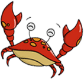
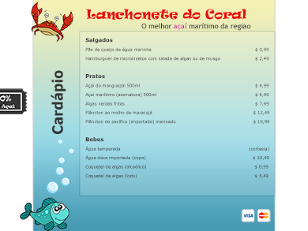
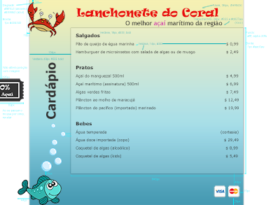
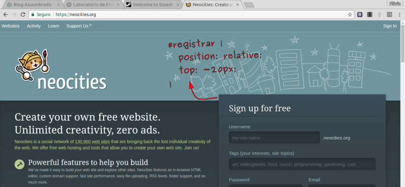
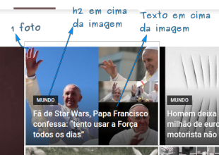

# CSS - Parte 4

---
# Roteiro de hoje

1. Criar a página da <span style="font-family: Ravie, serif; color: #e90c0c">Lanchonete do Coral 55</span>
1. Mais sobre Layout e posicionamento
1. A propriedade **line-height**
1. Centralizando as coisas

---
<!--
{
  "embeddedStyles": ".siri { background: linear-gradient(to bottom, aqua, silver); border: 3px double rgba(0,0,0,.2); } .ravie { font-family: Ravie, serif; color: #e90c0c; }"
}
-->
## Lanchonete do Coral 55 <!-- {.ravie} -->

 <!-- {.portrait.siri} -->

---
## Comp / Specs

[](../../images/coral55-comp.png)
[](../../images/coral55-specs.png)

*[Comp]: Comprehensive Layout*
*[Specs]: Specifications*

---
## Passos para o exercício

1. Instalar o git na máquina, caso ele não esteja instalado
1. Criar um _fork_ do repositório do professor em `https://github.com/daniel-hasan/cefet-web-coral55`
1. Fazer o exercício e fazer _commits_ e _push_ no seu repositório
1. Enviar, via **SIGAA**, o link do seu repositório até o final da aula

---
## Detalhes sobre o exercício

1. O objetivo é treinar **_Layout_ e posicionamento** em `CSS`
   - `position` (`static`, `relative`, `absolute`, `fixed`), `float`, `clear` etc.
1. O _layout_ que usamos no exercício dos Unicórnios se chama **fluido**. Hoje,
   você vai fazer um **_layout_ de tamanho fixo**
   - O conteúdo da página deve ter `800px` de largura e deve estar centralizado
   - Lembre-se sempre de como o box model funciona ;)

---
# _Layout_ e posicionamento

---
## _Layout_ e posicionamento (recapitulando)

- Vimos que o navegador **posiciona** elementos `block` e elementos `inline`
  usando algumas **regras de fluxo**
  - `block`s são colocados de cima para baixo e ocupam toda a largura
  - `inline`s são dispostos da esquerda para a direita
- Podemos alterar a posição de elementos de algumas formas
  - `width`, `height`
  - `margin`
  - `float`, `clear`
- Contudo, se quisermos um controle maior sobre a posição dos elementos,
  precisamos sair do fluxo padrão do navegador

---
<!-- {"layout": "section-header", "slideHash": "posicionamento-estatico"} -->
# Posicionamento estático
## Deixando o navegador definir o fluxo da página

- Relembrando o fluxo padrão
- A propriedade `position`
- O valor `static`

<!-- {ul:.content} -->
---
# A propriedade `position`

- **A propriedade `position`** permite definirmos se o navegador vai
  dispor um elemento usando **o fluxo padrão ou outro fluxo**
- Valores possíveis:
  1. `position: static` (valor padrão, para o fluxo padrão)
  1. `position: relative` (fluxo padrão, com deslocamento)
  1. `position: absolute`
  1. `position: fixed`
  1. `position: sticky`  <!-- {.emoji} -->

---
## Posição **estática**

- O próprio navegador encontra as posições (x,y) dos elementos
- Valor padrão - usa o posicionamento do fluxo padrão
  ```html
  <div class="estatico">Conteúdo</div>
  ```
  ```css
  .estatico {
    position: static; /* este já é o valor padrão */
  }
  ```
- <div style="display:inline-block;float:right;height:1em;font-size:.4em;"><input type="checkbox" checked id="button-estatico" class="switch" onclick="javascript: (function() { var b = document.getElementById('estatico'); b.classList.toggle('estatico');}())" />
    <label for="button-estatico">`.estatico`</label>
  </div>
  Resultado
  <style>.estatico {position: static;}</style>
  <div id="estatico" class="estatico" style="border: 3px dashed rebeccapurple">Conteúdo</div>

  - Definir um `position: static` não altera nada


---
<!-- {"layout": "section-header", "slideHash": "posicionamento-relativo"} -->
# Posicionamento relativo
## Deslocando elementos

- O valor `relative`
- **Deslocando** um elemento com as propriedades:
  1. `top`
  1. `right`
  1. `bottom`
  1. `left`

<!-- {ul:.content} -->

---
## Posicionamento **relativo**

- O elemento é posicionado como se estivesse no fluxo padrão, mas pode ser
  **deslocado** com as propriedades `top`, `right`, `bottom` e `left`
  ```html
  <div class="relativo1">Comporta-se como static...</div>
  <div class="relativo2">...Mas pode ter um deslocamento.</div>
  ```
  ```css
  .relativo1 { position: relative; }
  .relativo2 { position: relative; left: 30px; top: -10px; }
  ```
- <div style="display:inline-block;float:right;height:1em;font-size:.4em;"><input type="checkbox" checked id="button-relativo2" class="switch" onclick="javascript: (function() { var b = document.getElementById('relativo2'); b.classList.toggle('relativo2');}())" />
    <label for="button-relativo2">`.relativo2`</label>
  </div>
  Resultado:
  <style>.relativo2 { position: relative; left: 30px; top: -10px; }</style>
  <div style="position: relative; border: 3px dashed rebeccapurple; background: white;">Comporta-se como <code>static</code>...</div>
  <div id="relativo2" class="relativo2" style="border: 3px dashed green; background: white;">...Mas pode ter um deslocamento.</div>

---
<!-- {"layout": "regular"} -->
## Detalhes sobre `position: relative`

1. O elemento continua no **fluxo normal**, a menos que tenha suas propriedades
   `top` :arrow_up:, `right` :arrow_right:, `bottom` :arrow_down: e `left`
   :arrow_left: ajustadas.
1. A posição do elemento será **ajustada com relação à sua posição original**
   (caso ele fosse `static`)
1. Os elementos posteriores a um elemento com `position: relative` **não
   são ajustados** para ocupar eventuais "buracos" na página

---
<!-- {"layout": "regular", "backdrop": "exemplo-position-relative"} -->
## **Utilidade** do `position: relative` (1/2)

- É útil quando queremos que um elemento fique próximo de onde ele estaria,
  mas **levemente deslocado**
  - Legal para **"dar um charme"** no _layout_
 <!-- {.block.centered} -->
---
<!-- {"layout": "regular"} -->
## **Utilidade** do `position: relative` (2/2)

<style>
.button-img {
  position: relative;
}
.button-img:active {
  left: -3px;
  top: -3px;
}
</style>

- Podemos fazer um pequeno deslocamento dando a ideia de botão:
  ::: figure .push-right.center-aligned
   <!-- {.button-img} -->
  <br>Click me!
  :::
  ```css
  img {
    position: relative;
  }
  img:active {
    left: -3px;
    top: -3px;
  }
  ```
- Também utilizamos `position: relative` para definir um "plano de
  referência" para os filhos que estiverem com `position: absolute`
  (veremos mais adiante)

---
<!-- {"layout": "section-header", "slideHash": "posicionamento-absoluto"} -->
# Posicionamento absoluto
## Definindo (x,y) dos elementos

- O valor `absolute`
- **Posicionando** com:
  1. `top` :arrow_up:
  1. `right` :arrow_right:
  1. `bottom` :arrow_down:
  1. `left` :arrow_left:
- Casos comuns

<!-- {ul:.content} -->

---
## Posicionamento **absoluto**

- O elemento é colocado nas posições especificadas pelas propriedades
  `top` :arrow_up:, `right` :arrow_right:, `bottom` :arrow_down: e `left`
  :arrow_left:, considerando como referência **o ancestral
  mais próximo que esteja posicionado não estaticamente** (`relative`, `absolute` ou
  `fixed`)
  - Se não houver um ancestral, posiciona de acordo com elemento `<html>`
- **Não ocupa espaço**, já que o elemento é removido do fluxo

---
## Exemplo de posição absoluta


- ```html
  <div class="relativo">Este é um recipiente relativo.
    <div class="absoluto">Este é absoluto.</div>
  </div>
  ```
  ```css
  .relativo { position: relative; }
  .absoluto { position: absolute; width: 50%;
               right: 30px; bottom: 10px; }
  ```
  <div style="display:inline-block;float:right;height:1em;font-size:.4em;"><input type="checkbox" checked id="button-absoluto" class="switch" onclick="javascript: (function() { var b = document.getElementById('absoluto'); b.classList.toggle('absoluto');}())" />
    <label for="button-absoluto">`.absoluto`</label>
  </div>
  Resultado:
  <style>.absoluto { position: absolute; width: 50%; right: 30px; bottom: 10px; }</style>
  <div style="position: relative; height: 150px; border: 3px dashed rebeccapurple; background: white">Este é um recipiente relativo.
    <div id="absoluto" class="absoluto" style="border: 3px dashed green; background: white">Este é absoluto.</div>
  </div>

---
## **Utilidades** do `position: absolute`

1. <video src="../../videos/exemplo-position-absolute-steam.mp4" loop="0" class="push-right" controls></video>
   **Criar _"drop-downs"_** de opções que não "empurram" a página pra baixo
   (porque não ocupam espaço)
1. Colocar elementos "**um em cima do outro**"
    <!-- {.block.centered} -->
1.  <!-- {.push-right} -->
   **Posicionar** elementos em **qualquer lugar** na página

<!-- {ol:.bulleted} -->
---
<!-- {"layout": "regular"} -->
## **Detalhes** do `position: absolute`

- O elemento **não tem espaço reservado para ele**. Em vez disso, ele fica
  exatamente na posição especificada por `top`, `right`, `bottom`, `left`
  relativo ao **seu mais próximo antecessor-posicionado (não _static_)**
  <!-- {strong:.underline.upon-activation.delay-1600} -->

   <iframe width="100%" height="300" src="//jsfiddle.net/fegemo/nt2bqmar/embedded/result,html/" allowfullscreen="allowfullscreen" frameborder="0"></iframe>

<!-- isto é avançado demais
1. Margens se aplicam, porém elas não fazem _margin collapse_ com outras
   - Ou seja, elas sempre se somam
-->

---
<!-- {"layout": "section-header", "slideHash": "posicionamento-fixo"} -->
# Posicionamento fixo
## Definindo (x,y) dos elementos **na janela**

- O valor `fixed`
- **Posicionando** com:
  1. `top` :arrow_up:
  1. `right` :arrow_right:
  1. `bottom` :arrow_down:
  1. `left` :arrow_left:
- Casos comuns
- `z-index`

<!-- {ul:.content} -->

---
## Posicionamento **fixo**

- O elemento é posicionado de acordo com os valores das propriedades `top`,
  `right`, `bottom` e `left`, assim como `absolute`, porém **seu ponto de
  partida é o canto superior esquerdo da _janela_** <!-- {em:.underline.upon-activation.delay-1200} -->
- Não acompanha a rolagem da página
- Não ocupa espaço, já que o elemento é removido do fluxo

---
## Posição fixa (cont.)

- ```html
  <div class="fixo">Este é um elemento fixo.</div>
  ```
  ```css
  .fixo { position: fixed; right: 0; bottom: 10px; }
  ```
- Resultado:
  <iframe width="100%" height="240" src="https://jsfiddle.net/fegemo/s01Lc3a8/2/embedded/result,html,css/" allowfullscreen="allowfullscreen" frameborder="0"></iframe>

---
<!-- {"layout": "2-column-content-zigzag"} -->
## **Utilidade** do `position: fixed`

- Manter elementos **sempre na mesma posição**, independente da **barra
  de rolagem**


- Criar **caixas de diálogo modais** (que o usuário precisa interagir ou fechar)

---
## **position** -- Exemplo com todos

<style>
.minibola{
  display: inline-block;

  width:48px;

  padding: 4px 15px;
  border: 2px solid rebeccapurple;
  background: rgba(255, 255, 255, .5);
  border-radius: 70px;

}
</style>


- Considere que:
  - O div representado pelo **quadrado pontilhado** está como
    **`position:relative`**
  - O div <span class="minibola"> 2 </span> possui as propriedades:
    **`top:-20px`** e **`left: 30px`**

<iframe width="90%" height="50%" src="//jsfiddle.net/fegemo/jnjvsqy4/embedded/result,html,css/" allowfullscreen="allowfullscreen" frameborder="0" style="float: right"></iframe>

---
<!-- {"slideHash": "valores-position"} -->

| `position` | Descrição                                                         | Exemplos de uso                                                                                              | `top`, `right`, `bottom`, `left`      | `z-index`       |
|------------|-------------------------------------------------------------------|--------------------------------------------------------------------------------------------------------------|---------------------------------------|-----------------|
| `static`   | Fluxo normal                                                      | Elementos que **não requerem posicionamento especial**                                                       | ignorados                             | ignorado        |
| `relative` | Fluxo normal, deslocado                                           | Elementos que podem se **deslocar um pouco**; elementos **contextos para outros absolutamente posicionados** | **deslocamentos** nas 4 direções      | determina ordem |
| `absolute` | Removido do fluxo, posicionado em um (x,y) relativo a um contexto | Elementos que queremos **determinar os valores (x,y)** para posicioná-los exatamente em algum lugar          | **posições** referentes às 4 direções | determina ordem |
| `fixed`    | Removido do fluxo, posicionado em um (x,y) relativo à janela      | Idem ao `absolute`, mas a **posição é fixa na janela** (e não na página)                                     | **posições** referentes às 4 direções | determina ordem |

<!-- {table:style="transform: scale(.75)"} -->

---
## **z-index**
<style>
  .quadrado{
    height: 100px;
    width: 140px;
    border: 1px dashed black;
    position:absolute;
  }
  .q1{
    background-color:lightblue;
    z-index:1;
  }
  .q2{
    background-color:lightyellow;
    top:45px;
    left: 20px;
    z-index:2;
  }
  .q3{
    background-color:lightgreen;
    top:75px;
    left: 30px;
    z-index:3;


    }
</style>
- Define a ordem "no eixo Z" com a qual elementos que se tocam deve ser exibida
:::result
  <div style="width:200px;height:170px;">
    <div class="quadrado q1">
      z-index=1
    </div>
    <div class="quadrado q2">
      z-index=2
    </div>
    <div class="quadrado q3">
      z-index=3
    </div>

  </div>
:::

- Útil apenas para elementos `position: absolute` ou `position: fixed`


---
# A propriedade **line-height**

---
## A propriedade **line-height** ([na MDN](https://developer.mozilla.org/en-US/docs/Web/CSS/line-height))

- Define a altura de uma linha de texto.
- Inicialmente, `line-height: 1em;`, mas qualquer valor de medida de tamanho
  pode ser usado
  - Exemplo:
    ```css
    .espacamento-simples { line-height: 1em; }
    .espacamento-duplo   { line-height: 2em; }
    ```

    <p style="float: left; width: 45%; line-height: 1em; height: 100px; overflow: auto; border: 3px solid black">
      Lorem ipsum dolor sit amet, consectetur
    adipiscing elit. Curabitur mauris eros, fermentum eget dolor sit amet.</p>

    <p style="float: right; width: 45%; line-height: 2em; height: 100px; overflow: auto; border: 3px solid black">
    Lorem ipsum dolor sit amet, consectetur
    adipiscing elit. Curabitur mauris eros, fermentum eget dolor sit amet.</p>

---
# Centralizando as coisas

---
## Centralizando horizontalmente

- Existem várias formas para centralizar elementos que se aplicam a situações
  diferentes
- Centralizando conteúdo `inline`:
  ```css
  .centraliza { text-align: center; }
  ```
- Centralizando um elemento com largura definida
  ```css
  .centraliza-definida { margin: 0 auto; }
  ```

---
## Centralizando horizontalmente (cont.)

- Centralizando um elemento com `position` `absolute` ou `fixed`
  ```css
  .centraliza-position { left: (LARGURA_P - LARGURA_E)/2; }
  ```
  - Onde `LARGURA_P` é a largura do recipiente e `LARGURA_E` é a largura
    conhecida do elemento que queremos centralizar
- Centralizando um elemento com `position` `absolute` ou `fixed` em um
  recipiente fluido (largura pode variar)
  ```css
  .centraliza-fluido { left: 50%; margin-left: -(LARGURA_E / 2); }
  ```
- [Um guia sobre como centralizar qualquer elemento no site designshack.net](http://designshack.net/articles/css/how-to-center-anything-with-css/)

---
# Referências

- Capítulo 11 do livro
- [Propriedade **line-height** na MDN](https://developer.mozilla.org/en-US/docs/Web/CSS/line-height)
- [Um breve e interessante tutorial sobre posicionamento](http://learnlayout.com/position.html)
- [Técnicas para alinhamento vertical na smashingmagazine.com](http://www.smashingmagazine.com/2013/08/09/absolute-horizontal-vertical-centering-css/)
