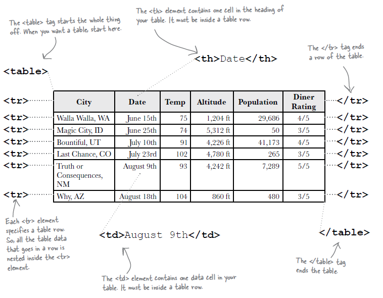

# HTML - Parte 2

---
# Hoje vamos

- Aprender sobre plantas carnívoras \o/
- Praticar `html`: imagens, hiperlinks, tabelas, citações, ênfase, destaque etc.
- Praticar `css`: _color_, _margin_, _text-align_ etc.

---
# Atividade de Hoje

Você tem um novo _hobby_: **criar plantas carnívoras**. Você encontrou um
documento solto em um antigo livro do seu tio e, depois de lê-lo, decidiu
**criar uma página web com seu conteúdo**. Além disso, você também tem
uma **pequena loja de sementes** dessas plantas e deseja divulgá-la em uma
página web.

<figure class="portrait">
  
</figure>

---
## Passos para o exercício

1. Instalar o git na máquina, caso ele não esteja instalado
1. **Criar um _fork_** do repositório do professor em [`https://github.com/fegemo/cefet-web-piranha-plant`](https://github.com/fegemo/cefet-web-piranha-plant)
  e **cloná-lo para sua área de trabalho**
1. Fazer o exercício e fazer _commits_ e _push_ no seu repositório
  - O arquivo `REAMDE.md` do repositório contém as instruções do exercício
1. Enviar, via **Moodle**, o link do seu repositório até o final da aula

---
## _Tags_ que indicam **Importância**

- <div>
    <strong>estou em destaque (tipicamente negrito)</strong>
  </div>
  ```html
  <strong>estou em destaque (tipicamente negrito)</strong>
  ```
- <div>
    <em>tenho ênfase (tipicamente itálico)</em>
  </div>
  ```html
  <em>tenho ênfase (tipicamente itálico)</em>
  ```
- <div>
    <del>fui riscado! (tipicamente riscado)</del>
  </div>
  ```html
  <del>fui riscado! (tipicamente riscado)</del>
  ```

---
## _Tags_ de **Citação**

- Citação **"em linha"**:
  <div>
    Romário disse: <q>o Pelé calado é um poeta.</q>
  </div>
  ```html
  Romário disse: <q>o Pelé calado é um poeta.</q>
  ```
- Citação **"em bloco"**:
  <div>
    <blockquote>Tô quebrado, peixe</blockquote> - Romário negando-se a
    pagar mais de R$ 3 mil de pensão
  </div>
  ```html
  <blockquote>Tô quebrado, peixe</blockquote> - Romário
  negando-se a pagar mais de R$ 3 mil de pensão
  ```

---
## _Tag_ de **_Hyperlink_** (1/3)

- [Link para fora da página](http://www.google.com):
  ```html
  <a href="http://www.google.com">Link para fora da página</a>
  ```
- [Link para um arquivo](../../images/flavio-avatar.jpg) que o navegador sabe
  abrir (_e.g._, uma imagem):
  ```html
  <a href="images/flavio-avatar.jpg">Link para um arquivo</a>
  ```
- [Link para um arquivo](../../attachments/exemplo.zip) que o navegador não
  sabe abrir (_e.g._, `.zip`):
  ```html
  <a href="attachments/exemplo.zip">Link para um arquivo</a>
  ```

---
## _Tag_ de _Hyperlink_ (2/3)

- [Link para email](mailto:adamastor@fazenda.mg.br) - abre o programa de email
  do usuário:
  ```html
  <a href="mailto:adamastor@...">Link para cliente de email</a>
  ```
  - Repare o **`mailto:`** antes do endereço de email
- [Link para telefone](tel:+553130143045):
  ```html
  <a href="tel:+553133196870">3319-6870</a>
  ```

---
## _Tag_ de _Hyperlink_ (1/3)

- [Link para uma outra página](/classes/html1/index.html) do próprio site:
  ```html
  <a href="outra_pagina.html">Outra página</a>
  ```
- [Link para dentro da página](#uma-secao-do-site) - rola até a seção:
  ```html
  <a href="#um-id-de-elemento">Link para dentro da página</a>
  ```
  - Repare o `#um-id-de-elemento`
    ```html
    <!-- ...outras coisas... -->
    <h2 id="um-id-de-elemento">Um título</h2>
    ```
    - Ao clicar no link, o navegador vai rolar a barra até que esse `<h2></h2>`
      fique visível e no topo do navegador

---
## _Tags_ de **Lista de Itens** (1/2)

- Lista **não ordenada** (bolinhas):
  <ul>
    <li>Item 1</li>
    <li>Item 2</li>
  </ul>
  ```html
  <ul>
    <li>Item 1</li>
    <li>Item 2</li>
  </ul>
  ```

---
## Tag de Lista de itens (2/2)

- Lista **ordenada** (números):
  <ol>
    <li>Item</li>
    <li>Item</li>
  </ol>
  ```html
  <ol>
    <li>Item</li>
    <li>Item</li>
  </ol>
```

---
## _Tags_ de **Tabela**

- Tabelas são criadas com as tags:
  - **`table`**, para marcar a tabela
  - **`tr`**, linha
  - **`td`**, célula
  - `th`, célula do cabeçalho
  - `thead`¹, marca as linhas do **cabeçalho**
  - `tbody`¹, marca as linhas do **corpo**
  - `tfoot`¹, marca as linhas do **rodapé**
- [Referência na Mozilla Developer Network][mdn-table]
- ¹: elementos opcionais, mas desejáveis

[mdn-table]: https://developer.mozilla.org/en-US/docs/Web/HTML/Element/table

---


---
## Exemplo: **tabela simples** (1/3)

```
&lt;table>
  &lt;tr>
    &lt;th>Fruta&lt;/th>
    &lt;th>Preço&lt;/th>
  &lt;/tr>
  &lt;tr>
    &lt;td>Goiaba&lt;/td>
    &lt;td>R$ 1,89/Kg&lt;/td>
  &lt;/tr>
&lt;/table>
```
- Apenas uma tabelinha 2x2
- Exemplo: http://jsfiddle.net/fegemo/wL3zg2y1/11/

---
## Exemplo: **mesclando células horizontais** (2/3)

```
&lt;table>
  &lt;tr>
    &lt;th colspan="2">Pessoas&lt;/th>
  &lt;/tr>
  &lt;tr>
    &lt;td>2005046102&lt;/td>&lt;td>Epaminondas&lt;/td>
  &lt;/tr>
&lt;/table>
```
- **`colspan="X"`** faz com que aquela **célula ocupe `X` colunas**
  - Para mesclar células "para baixo", usamos **`rowspan="Y"`**, onde `Y` é o
    **número de linhas** que a célula vai ocupar
- Exemplos: de [`colspan`](https://jsfiddle.net/fegemo/o6gsb0t9/) e
  de [`rowspan`](https://jsfiddle.net/fegemo/65rvt05m/)

---
## Exemplo: **legenda, cabeçalho e rodapé** (3/3)

```
&lt;table>
  &lt;caption>Alunos de Web&lt;/caption>
  &lt;thead>
    &lt;tr>
      &lt;th colspan="2">Pessoas&lt;/th>
    &lt;/tr>
  &lt;/thead>
  &lt;tbody>
    &lt;tr>
      &lt;td>2005046102&lt;/td>&lt;td>Epaminondas&lt;/td>
    &lt;/tr>
  &lt;/tbody>
&lt;/table>
```
- Exemplo: http://jsfiddle.net/fegemo/wL3zg2y1/7/

---
## Agora, algumas **propriedades <u>CSS</u>** (1/3)

```css
p {
  color: #ff0033;       /* cor do texto: vermelho */
  font-family: "Arial", sans-serif;
  text-align: center;   /* left, right, justify */
}

body {
  /* imagem de fundo para a página */
  background-image: url(imagens/fundo-da-pagina.png);

  /* faz o conteúdo da página começar a 10%
    da largura lateralmente */
  margin-left: 10%;
  margin-right: 10%;
}

```

---
## Mais algumas propriedades (2/3)

```css
/* coloca uma borda azul em toda  */
img {
  border: 1px solid blue; /* azul, sólida, de 1px */
}

/* muda a cor de todos <h1></h1> e <h2></h2> */
h1, h2 {
  color: brown;   /* cor do texto: marrom */
}
```

---
## Mais ainda (3/3)

```css
table {
  /* tira espaço entre as bordas */
  border-collapse: collapse;

  /* centraliza a tabela e define uma largura */
  width: 300px;
  margin-left: auto;
  margin-right: auto;
}

td, th {
  border: 1px solid silver;
}
```

---
# Referências

1. Capítulos 1, 2 e 3 do livro
1. Darwin, C. [Insectivorous Plants][darwin-carnivoras]. John Murray, 1875.
1. [Artigo sobre plantas carnívoras do site InfoEscola][info-escola]

[info-escola]: http://www.infoescola.com/plantas/plantas-carnivoras/
[darwin-carnivoras]: http://darwin-online.org.uk/content/frameset?itemID=F1217&viewtype=text&pageseq=1
