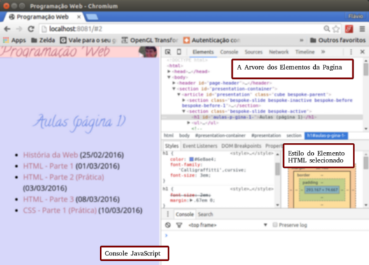
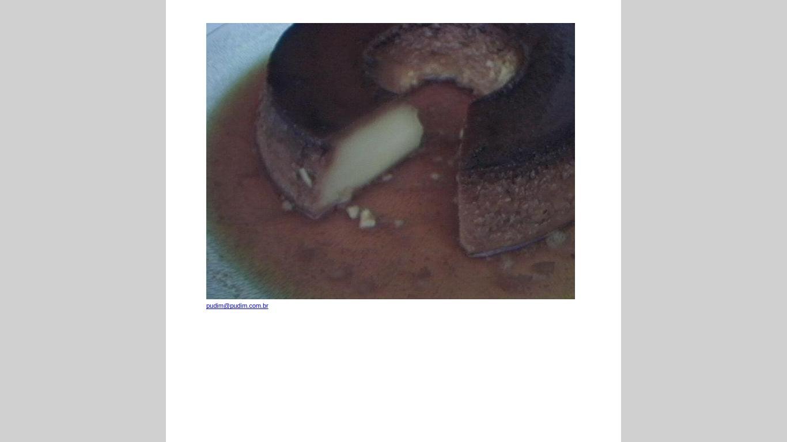
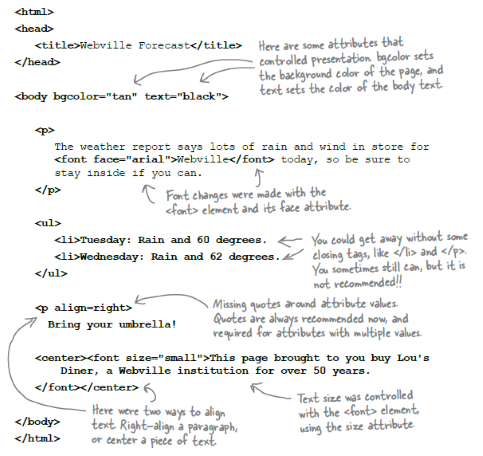

# HTML - Parte 3

---
## Na última aula...

- Podemos **criar hiperlinks** com o elemento `<a href="caminho-do-recurso">nome</a>`
- Para **incluir imagens**, podemos usar a tag ``
- Citações são criadas com `<q>` ou `<blockquote>`
- Alguns elementos são `inline` e outros são `block`
  - **`inline`**: não fazem quebra de linha (e.g, `<q>`, `<strong>` etc.)
  - **`block`**: fazem quebra de linha (e.g., `<blockquote>`, `<p>` etc.)

---
## Na última aula... (cont.)

- Tabelas são criadas com as tags
  - **`table`**, para marcar a tabela
  - `thead`, cabeçalho
  - `tbody`, corpo
  - `tfoot`, rodapé
  - **`tr`**, linha
  - **`td`**, célula
  - `th`, célula do cabeçalho
- [Referência na Mozilla Developer Network][mdn-table]

[mdn-table]: https://developer.mozilla.org/en-US/docs/Web/HTML/Element/table

---
## Na última aula... (cont.)

- Uma célula pode ocupar mais de uma coluna ou mais de uma linha
  - `... colspan="2"`, para ocupar duas colunas
  - `... rowspan="2"`, para ocupar duas linhas
- Exemplo de tabela
  - [Simples][tab-simples]
  - [Completo][tab-completa]

[tab-simples]: http://jsfiddle.net/fegemo/wL3zg2y1/1/
[tab-completa]: http://jsfiddle.net/fegemo/wL3zg2y1/2/

---


---
## Na última aula... (cont.)

- É possível declarar regras em CSS de três formas
  1. _Inline_
  ```html
  <p style="color: #fff">...</p>
  ```
  2. _Embedded_
  ```html
    <style>
        p {
          color: #fff;
        }
    </style>
  ```
  3. continua...

---
## Na última aula... (cont.)
1. _Linked_
```html
  <link rel="stylesheet" href="arquivo-de-estilos.css" />
```

---
# Hoje veremos

1. Editores de texto/IDEs
1. Depurando páginas web
1. Um pouco mais sobre **imagens**
1. Mapas de imagens
1. Meta _tags_
1. Codificação (_encoding_)
1. DOCTYPE (versão do HTML)

---
# **Editores de Texto** e **<abbr title="Integrated Development Environment">IDE</abbr>s**

---
## Como ser mais **produtivo**

- Na hora de escrever/editar código HTML, CSS e JavaScript, queremos ter:
  - **Destacamento de código fonte**
  - **Indentação** automática
  - **Auto-completar** tags HTML, propriedades CSS etc.
- É desejável:
  - Suporte a controle de versão (_e.g._, git)
  - _Linting_ (verificação estática de erros no código)

---
## Exemplos com **_Seal of Approval_** do Professor

- Editor:
  - [Atom][atom] (gratuito, do GitHub)
  - [Sublime Text 3][sublime] (pago, faz vista grossa com quem não paga)
  - [Notepad++][notepad] (gratuito, levão)
- IDE:
  - [WebStorm][webstorm] (pago, da JetBrains)
  - [Visual Studio Express][visual] (gratuito, do tio Bill)

[atom]: https://atom.io/
[sublime]: https://www.sublimetext.com/3
[notepad]: https://notepad-plus-plus.org/
[webstorm]: https://www.jetbrains.com/webstorm/
[visual]: https://www.visualstudio.com/features/modern-web-tooling-vs

---
## Sugestão do Professor

- [](https://atom.io)
  Benefícios:
  - **Gratuito**
  - Mais **leve** do que um IDE
  - Altamente **personalizável**
  - Exemplo de **"web fora do navegador"** - É baseado no Chromium e no Node.js
  - Suporte nativo a **Git**
  - Muitas **_hotkeys_ \o/**

---
# **Depurando** Páginas Web

---
## Ferramentas do Desenvolvedor

- Os navegadores possuem **excelentes ferramentas de suporte** ao programador



---
## Usando as Ferramentas

- Visualizando o código fonte:
  - Tecla de atalho no Chrome: <kbd>Ctrl-U</kbd>
  - Ou então:
    1. clicar com **botão direito** do Mouse **na página**
    1. selecionar **"Ver código fonte"**
- Ativando o depurador:
  - Tecla de atalho padrão: <kbd>Ctrl-Shift-I</kbd> ou <kbd>F12</kbd>
  - Ou então:
    1. clicar com **botão direito** do Mouse **na página**
    1. selecionar **"Inspecionar elemento"**

---
# Exercícios

---
## Exercício 1: Programador sem café


O código abaixo refere-se a uma página que deveria estar mostrando algumas
músicas, contudo o programador que criou o código estava precisando de um
pouco mais de café e acabou por cometer alguns erros. Você deve corrigir o
código de forma que ele fique correto.

Baixe o [exercício][exer-prog-sem-cafe] ou pegue uma cópia com o professor.

[exer-prog-sem-cafe]: https://docs.google.com/document/d/1mK1CivW4PZuIccktKA-1Yv4dKvSx8bWfRd7Mv1M5YRU/edit?usp=sharing

---
## Exercício 2: Festa a fantasia das tags


Um grupo de elementos HTML, usando fantasia, está fazendo uma festa com a
temática "Quem sou eu?". Eles dão uma dica e você tenta adivinhar que
elemento está falando.

Baixe o [exercício][exer-who-am-i] ou pegue uma cópia com o professor.

[exer-who-am-i]: https://docs.google.com/document/d/1_l-GYO7LDB9N6LUwNT4qtxj3ij2xs3hVgp8F0ULqJD4/edit?usp=sharing

---
# Um pouco mais sobre **imagens**

---
## Imagens

- Usamos a tag ``, que é um **elemento _void_**
  - Ou seja, não tem conteúdo nem tag de fechamento
- Formato geral
  ```html
  
  ```
- [Referência na Mozilla Developer Network][mdn-img]

[mdn-img]: https://developer.mozilla.org/en-US/docs/Web/HTML/Element/img

---
## Imagens (cont.)

- Além do atributo `src`, é muito recomendável usar o **atributo `alt`** com um
  **texto explicativo que possa substituir a imagem**, em caso do usuário não
  poder vê-la por algum motivo
  ```html
  
  ```
- Quando o navegador está renderizando uma página e se depara com uma ``
  ele faz outra requisição ao servidor para baixá-la e então poder exibi-la

---


- http://www.pudim.com.br

---
## Imagens (cont.)

- Existem vários formatos de imagens suportados por navegadores
  - **JPEG**, bom para (i.e., compacta bem) fotos e imagens complexas
  - **GIF**, transparência de 1 bit e suporta animações de quadros
  - **PNG**, transparência de 8 bits (rgba) e suporta mais cores que GIF
  - **SVG**, imagens vetoriais

---
## Imagens (cont.)

- Podemos **definir largura e altura** de imagens em pixels via atributos
  ```html
  
  ```
- Mas quase sempre (99%) devemos preferir **estipular os tamanhos via CSS**
  ```html
  <style>
    img {
      width: 40px;
      height: 100px;
    }
  </style>
  ```

---
# Mapas de imagens

---
## Problema:

- Você tem imagens grandes e quer que o usuário acesse hiperlinks
  diferentes dependendo de onde ele clicar na imagem
  - Opção 1: picotar a imagem grande em várias menores e encapsular cada
    `` dentro de um `<a></a>`
    - Dá trabalho demais
    - E se você quiser uma região circular em vez de retangular?
  - Opção 2: usar o recurso do `html` para **mapas de imagens**

---
## Exemplo de mapa de imagem

- Exemplo:
  ```html
  <map name="jogos">
    <area href="..." shape="rect" coords="125,19,182,161" />
    <area href="..." shape="poly" coords="274,29,260,42,255,61,..." />
    <area href="..." shape="circle" coords="436,418,50" />
  </map>
  
  ```
---
## Resultado do exemplo

- Resultado:

  
  <map name="image-maps-2014-10-22-192942" id="ImageMapsCom-image-maps-2014-10-22-192942">
  <area  alt="O desenho de uma mulher" title="Jogo Syberia" href="https://www.google.com.br/search?q=syberia+game&safe=off&hl=pt-BR&source=lnms&tbm=isch&sa=X&ei=t0JIVLyYC_WCsQSk-4KACA&ved=0CAgQ_AUoAQ&biw=1366&bih=643" shape="rect" coords="125,19,182,161" style="outline:none;" target="_self"     />
  <area  alt="Um soldado" title="Neuroshima Hex" href="https://www.google.com.br/search?q=Neuroshima+Hex+game&safe=off&hl=pt-BR&source=lnms&tbm=isch&sa=X&ei=yEJIVPurEenksAS91YGoCg&ved=0CAgQ_AUoAQ&biw=1366&bih=643" shape="poly" coords="274,29,260,42,255,61,251,80,253,109,263,113,267,123,237,149,276,155,340,154,335,138,289,133,289,122,290,104,292,89,298,82,303,98,319,83,339,71,325,55,307,53,303,30" style="outline:none;" target="_self"     />
  <area  alt="Um bardo bárbaro" title="Bardbarian" href="https://www.google.com.br/search?q=bardbarian+game&safe=off&hl=pt-BR&source=lnms&tbm=isch&sa=X&ei=u0JIVNaMHoa1sQSm4oKYCg&ved=0CAkQ_AUoAg&biw=1366&bih=643" shape="poly" coords="439,20,411,26,387,42,371,66,365,94,371,122,387,146,411,162,439,168,467,162,491,146,507,122,513,94,507,66,491,42,467,26" style="outline:none;" target="_self"     />
  </map>

---
## Mapa de Imagem (na [MDN](https://developer.mozilla.org/pt-BR/docs/Web/HTML/Element/map))

- O mapa é representado pelo elemento `<map></map>`, que possui um `name`
- Dentro do mapa, coloca-se um `<area />` para cada região que se quer ter um
  hiperlink, definindo os detalhes do link e as coordenadas
- As regiões podem ser de três tipos:
  1. `shape="rect"`, `coords="left, top, right, and bottom"`
  1. `shape="circle"`, `coords="x, y, radius"`
  1. `shape="poly"`, `coords="x1, y1, x2, y2, x3, y3, ..."`
- A imagem (``) deve usar o atributo `usemap="nome"` para se referenciar
  ao mapa

---
## Prós e Contras

- Prós
  - Mais prático que imagens picotadas
  - Única forma para se definir áreas não retangulares de links
- Contras
  - Pode dar trabalho gerar as coordenadas
  - Não é fluido - se a imagem é redimensionada, os valores (em px) não serão
    mais válidos

---
# Meta _tags_

---
## Meta _tags_

```
&lt;html&gt;
	&lt;head&gt;
	  &lt;title&gt; Aprendendo sobre as meta tags &lt;/title&gt;
	  &lt;meta name="author" content="Flávio"&gt;
	  &lt;meta name="description" content="Textão explicativo"&gt;
	  &lt;meta name="keywords" content="web, css, html, js"&gt;
	&lt;/head&gt;
	...
```

- _Tags_ meta são elementos _void_
- Referência na [MDN](https://developer.mozilla.org/en-US/docs/Web/HTML/Element/meta)

---
## Meta _tag_: **keywords**

- Palavras-chave de descrição da página
- Limite (de bom senso) de aproximadamente 150 caracteres
- Palavras separadas por vírgula, geralmente com tudo em minúsculo
- Exemplo _real-life_:
  ```html
  <meta name="keywords" content="livro,games,ultrabook,ipad,macbook,blu-ray,celular,TV led ,gps,câmera digital">
  ```
  - Página inicial do site submarino.com.br

---
## Meta _tag_: **description**

- Um breve e preciso texto sumário do conteúdo da página
- Alguns navegadores usam isto como a descrição da página quando adicionada aos favoritos
- Exemplo:
  ```html
  <meta name="description" content="Meet the global face of the world's #1 games media brand.">
  ```
  - Página inicial do site ign.com

---
## Meta _tags_: **author** e **robots**

- `author`: nome dos autores da página
  - Exemplo:
    ```html
    <meta name="author" content="Flávio Coutinho">
    ```
- `robots`: indicar a buscadores (_crawlers_) se eles devem indexar a página ou não
  - Exemplo:
    ```html
    <meta name="robots" content="index,follow">
    ```
  - A forma mais recente é usar um arquivo [/robots.txt com descrições](http://www.robotstxt.org/orig.html)

---
## Meta _tag_: **refresh**

- Formato:
  ```html
  <meta name="refresh" content="X Y">
  ```
- Faz um redirecionamento dentro de X segundos para o endereço Y
- Exemplo:
  ```html
  <meta name="refresh" content="5 ;url=http://www.pudim.com.br/">
  ```

---
## Meta _tag_: **viewport**

- Sugere ao navegador qual o tamanho inicial da _viewport_ (área visível) da página
- Usado especialmente por navegadores de dispositivos móveis
- Exemplo:
  ```html
  <meta name="viewport" content="width=device-width, initial-scale=1, maximum-scale=1">
  ```
  - [Referência completa na W3C](http://dev.w3.org/csswg/css-device-adapt/#viewport-meta)

---
# Codificação (_encoding_)

---
## Codificação

- A codificação de uma página deve ser especificada de forma explícita
  - Senão, UTF-8 é inferido
- Usa-se a `<meta>` _tag_ com nome `charset` para isso:
  ```html
  <meta name="charset" content="ISO-8859-1">
  ```
  - Opções de codificação são gerenciadas pela IANA e [podem ser vistas aqui](http://www.iana.org/assignments/character-sets/character-sets.xhtml)
- 
  Erro de codificação:
  - Deve-se manter a mesma codificação do banco de dados e da página


---
# DOCTYPE

---
## DOCTYPE

- Especifica para o navegador qual a versão do `html` que estamos usando
- Aparece como a primeira "tag" em um arquivo `html`
- Formato
  ```
  &lt;!DOCTYPE ... &gt;
  ```
---
## Evolução do DOCTYPE

- HTML 4.01
  ```
  &lt;!DOCTYPE html PUBLIC "-//W3C//DTD HTML 4.01//EN"
  "http://www.w3.org/TR/html4/strict.dtd"&gt;
  ```
- XHTML 1.1
  ```
  &lt;!DOCTYPE html
    PUBLIC "-//W3C//DTD XHTML 1.1//EN"
    "http://www.w3.org/TR/xhtml11/DTD/xhtml11.dtd"&gt;
  ```

---
## DOCTYPE hoje

- HTML5
  ```
  &lt;!doctype html&gt;
  ```
  

---
## E se colocarmos um DOCTYPE inválido?

- O navegador possui o conceito de _strict mode_ e o de _quirks mode_
- Problemas com o DOCTYPE vão ativar o **_quirks mode_**
  - Para páginas sem DOCTYPE ou com DOCTYPEs que o navegador não conhece
- Em _quirks mode_, o navegador é altamente **permissivo com relação a marcação
  incorreta** e ele utiliza um interpretador antigo para algumas propriedades
  CSS
- [Artigo sobre o _quirks mode_ no site quirksmode.org][quirks-mode] :)

[quirks-mode]: http://www.quirksmode.org/css/quirksmode.html

---
## Validação

- Já que temos um **_strict mode_**, podemos validar uma página para ver se
  ela está seguindo o padrão corretamente
  - http://validator.w3.org/
- Atividade: vamos validar nosso exemplo da aula HTML 1
  - [Código no jsfiddle](http://jsfiddle.net/fegemo/9po3sd1m/2/presentation/)

---
## Erros

1. Precisamos declarar qual o _encoding_ estamos usando no arquivo nos primeiros
512 bytes (dentro do `head`)
1. Toda imagem precisa ter um atributo `alt`
1. Não se pode/deve utilizar valores em porcentagens nos atributos `width` e
  `height` de imagens

---
## Arqueologia HTML



---
# Referências

1. Capítulos 5 e 6 do livro
