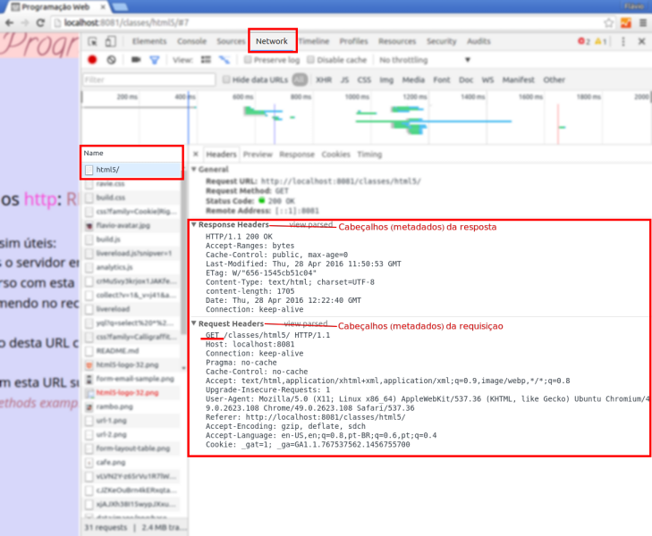
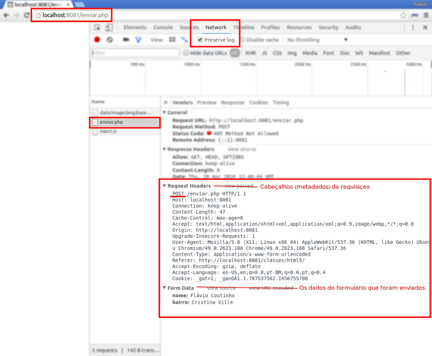
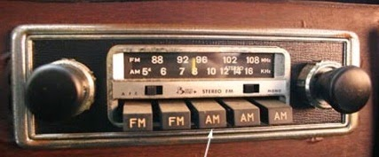
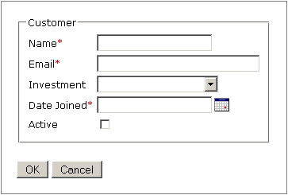

<!-- {"layout": "title"} -->
# HTML - Parte 5
## Formulários e Monstros

---
# Roteiro

1. Como os formulários funcionam
1. Elementos de **dados**
1. Elementos de **ação**
1. Métodos de envio: GET ou POST?
1. Validação
1. Exercício: O que é o que é?

---
# Como funcionam os formulários

---
## Motivação

- Até agora, vimos que o protocolo HTTP usa um **modelo de requisição e
  resposta**, em que um **navegador (cliente) solicita** recursos (e.g., páginas,
  imagens) para um servidor e o **servidor responde** com o conteúdo do arquivo
  - Ou seja, aparentemente apenas o servidor pode enviar conteúdo
- Assim, como fazer se quisermos solicitar informação dos usuários?
  - Isso seria o **cliente enviando (_uploading_) informações para
    o servidor**...

---
## Métodos **http**

- Lembre-se: o HTTP é a língua com que um navegador e servidor conversam
- Sendo assim, o `http` possui vários métodos (também chamados de "verbos") e
  alguns deles **permitem o envio de informações por parte do cliente**
  - O método que vimos até agora se chama `GET`
  - Um exemplo de requisição `GET`:
    ```
    GET /en-US/docs/Web/CSS/animation HTTP/1.1
    Host: developer.mozilla.org
    ```
  - No próximo slide, veja uma requisição GET e a resposta do servidor

---


---
## Outros Métodos **http**: [RFC2616](http://tools.ietf.org/html/rfc2616#section-9)

- Os mais comuns (~97% das requisições na web):
  - **`GET`**: "me vê o ~~documento~~ recurso com esta URL"
    - Servidor responde com o conteúdo do documento + metadados sobre ele
  - **`POST`**: "envie estes
    dados para a ~~página~~ recurso com esta URL"
    - Usado para enviar informações do cliente para o servidor

---
## Outros Métodos **http**: [RFC2616](http://tools.ietf.org/html/rfc2616#section-9) (cont.)

- Os mais _hipsters_, ainda assim úteis:
  - **`HEAD`**: igual ao `GET`, mas o servidor envia apenas os
    metadados
  - **`DELETE`**: "exclua o recurso com esta URL"
  - **`PATCH`**: "faça uma modificação no recurso desta URL com o que estou enviando"
  - **`PUT`**: "atualize o recurso desta URL com o que estou lhe enviando"
  - **`OPTIONS`**: "o recurso com esta URL suporta quais verbos?"
- Veja [_Where to find HTTP methods examples_](http://stackoverflow.com/questions/765565/where-to-find-http-methods-examples)
  no StackOverflow

---
## Exemplo de formulário

- Um formulário tipicamente usado para contato:
  ```html
  <form action="/enviar.php" method="POST">
    <label>Seu nome: <input name="nome"></label>
    <label>Seu bairro: <input name="bairro"></label>
    <input type="submit" value="Enviar">
  </form>
  ```
- Resultado:
  <form action="/enviar.php" method="POST">
    <label>Seu nome: <input name="nome"></label>
    <label>Seu bairro: <input name="bairro"></label>
    <input type="submit" value="Enviar">
  </form>

  - Clique em "Enviar" e perceba que **o navegador navegou para o
    endereço `/enviar.php`**


---


---
## Como montar um formulário

- Usa-se o elemento `<form></form>` com alguns `<input>`
- **Atributos** do `<form></form>`:
  - **`method="..."`** pode ter o valor `POST` ou `GET` e <u>altera o
    método `http`</u> a ser usado para fazer a requisição quando o formulário for
    submetido
  - **`action="..."`** aponta para qual ~~arquivo~~ recurso a
    requisição `POST` ou `GET` será feita
  - **`enctype="..."`** descreve como os dados do formulário são
    <u>codificados</u> para serem transmitidos em uma requisição `http`:
      1. `application/x-www-form-urlencoded`, **formato padrão**
      1. `multipart/form-data`, para envio (_upload_) de arquivos
      1. `text/plain`, desencorajado - apenas para _debug_

---
## Como funciona o exemplo (1/2)

- Os dados de um formulário só são **enviados** quando o **<u>botão de
  submissão</u> é ativado**
  - `<input type="submit" value="Enviar">`, ou
  - `<button type="submit">Enviar</button>` (a partir do HTML5)
    - `<button>Enviar</button>` também dá, porque `type="submit"` é o padrão

---
## Como funciona o exemplo (2/2)

- Quando ocorre a submissão, o navegador realiza uma requisição `http` usando
  um método (atributo `method` do `form`) para um endereço (`action`):
  ```
  POST /enviar.php HTTP/1.1
  Host: fegemo.github.io

  nome=Flavio&bairro=Cristina%20Ville
  ```
  - Repare que os dados são enviados como uma _string_ de pares de nome
    e valor concatenados com o sinal &amp;
  - **!!** Os **nomes dos campos** ("nome" e "bairro") **advêm do atributo
    `name`** dos `input`s (e não do atributo `id`). Por exemplo:
    `<input type="text" name="bairro">`

---
## **No servidor**, como receber os dados?

- Cenas dos próximos capítulos... mas:
  - O servidor web pode ser configurado para "escutar" por requisições `POST`,
    além de apenas `GET`
  - Quando chega uma requisição `POST`, ela vêm com um **_payload_ de dados**:
    - Uma **requisição `POST` tem conteúdo** (o _payload_), além dos metadados
  - Ao tratar uma requisição `POST` no servidor, você pode usar o _payload_
    para o que quiser, _e.g._:
    - Cadastrar um usuário no banco de dados
    - Enviar um email
    - Alterar a descrição de um produto no banco de dados etc.

---
<!-- {"layout": "section-header", "slideHash": "elementos-de-entrada"} -->
# Elementos HTML de **entrada**
## Interação "livre" com usuário

- O elemento `input` e alguns tipos:
  - texto, e-mail, telefone, número, cor
- Rótulos: relembrando o `label`
- O elemento `textarea`
- Interagindo via JavaScript

<!-- {ul^1:.content} -->

---
<!-- {"layout": "regular"} -->
## Caixa de texto

- Elemento HTML onde o usuário pode digitar qualquer coisa
- Formato:
  ```html
  <input id="palavra" type="text" placeholder="Digite..."> <!-- exemplo abaixo -->
  <input id="palavra">
  <input>
  ```
  - `type="text"` é o valor padrão para o `input`
  - `placeholder="um texto..."` define um texto de ajuda que só aparece
    quando não há nada digitado

::: result
<input type="text" placeholder="Digite...">
:::

---
<!-- {"layout": "regular"} -->
## Rótulos <small>(ou etiquetas)</small>

- Tipicamente atribuímos rótulos (`<label></label>`) aos campos (`input`)
  - Podemos clicar nos rótulos e o foco será movido para dentro do `input`
    a ele associado
  - Há 02 formas de associação:
    ```html
    <label for="cidade">Cidade: </label><input id="cidade">
    <!-- ...ou... -->
    <label>Cidade:
        <input id="cidade">
    </label>
    ```
    ::: result
      <div><label>Cidade: <input id="cidade"></label></div>
    :::

---
<!-- {"layout": "regular"} -->
## Caixa de texto para **e-mail** 

- 
  Idêntico à caixa de texto, porém o navegador espera um e-mail válido
- Formato:
  ```html
  <label>Remetente:
    <input id="remetente" type="email">
  </label>
  ```
  - Em _smartphones_, os navegadores mudam o _layout_ do teclado colocando
    "@" em posições mais fáceis
::: result
<div><label>Remetente:
  <input id="remetente" type="email">
</label></div>
:::

---
<!-- {"layout": "regular"} -->
## Outros semelhantes à caixa de texto 

- Pesquisa<br> <!-- {ul:style="display: flex; flex-direction: row; justify-content: space-around"} -->
  `<input type="search">`: <input type="search" style="width: calc(100% - 1em); box-sizing: border-box; margin-bottom: 1em;">
   <!-- {style="width: calc(100% - 1em)"} -->
- URL<br>
  `<input type="url">`: <input type="url" style="width: calc(100% - 1em); box-sizing: border-box; margin-bottom: 1em;">
   <!-- {style="width: calc(100% - 1em)"} -->
- Telefone<br>
  `<input type="tel">`: <input type="tel" style="width: calc(100% - 1em); box-sizing: border-box; margin-bottom: 1em;">
     <!-- {style="width: calc(100% - 1em)"} -->


---
<!-- {"layout": "regular"} -->
## Números, Escala e Cor 

- Formato: <!-- {ul:style="display: flex; flex-direction: row; justify-content: space-around"} -->
  ```html
  <input type="number" step="0.5">
  <input type="range" min="0" max="100" step="1">
  <input type="color">
  ```
- ::: result . background-color:white;
  1. <input type="number" step="0.5" size="4"><br>
  2. <input type="range" min="0" max="100" step="1"><br>
  3. <input type="color">
  :::
1. `number` é indicado para digitação de um número específico
1. `range` para uma escala (_e.g._, quente ou frio?)
   - `number` e `range` aceitam `min`, `max` e `step` (incremento)
1. `color` para pegar o valor hexadecimal de uma cor

---
<!-- {"layout": "regular"} -->
## Data e Hora 

- Formato: <!-- {ul:style="display: flex; flex-direction: row; justify-content: space-around"} -->
  ```html
  <input type="date">
  <input type="time">
  <input type="datetime-local">
  <input type="month">
  <input type="week">
  ```
- ::: result
  1. <input type="date"><br>
  2. <input type="time"><br>
  3. <input type="datetime-local"><br>
  3. <input type="month"><br>
  3. <input type="week">
  :::

1. Observações:
   - `date` é apenas uma data, `time` apenas um horário
   - `datetime-local` é um dia/horário

---
<!-- {"layout": "regular"} -->
## Interagindo via JavaScript

- Todo `<input>` possui o **atributo `value`**, que é o **valor <u>padrão</u>**.
  Exemplo:
  - `<input type="number" value="5">`: <input id="qtde-pizzas" type="number" value="5" style="width: 3em;">
    <button onclick="alert(document.querySelector('#qtde-pizzas').value)">(1) Pegar</button>
    <button onclick="document.querySelector('#qtde-pizzas').value = 25">(2) Definir</button>
- Para pegar (_get_) ou definir (_set_) o
  **valor <u>atual</u>** <!-- {.alternate-color} --> via JavaScript, (a) pegamos
  o elemento no DOM e (b) acessamos a
  **propriedade `value`**: <!-- {.alternate-color} -->
  ```js
  let quantidadePizzasEl = document.querySelector('#qtde-pizzas');

  // podemos pegar o valor atual no console acessando .value:
  let qtdePizzasAtual = quantidadePizzasEl.value; // botão 1
  alert(qtdePizzasAtual);

  // ou podemos definir um novo valor para o elemento:
  quantidadePizzasEl.value = 25;                  // botão 2
  ```

---
<!-- {"layout": "section-header", "slideHash": "elementos-de-escolha"} -->
# Elementos HTML de **escolha**
## Pegando a escolha do usuário

- O `input` do tipo `checkbox`
- O `input` do tipo `radio`
- O elemento `select` e suas `option`s
- Interação via JavaScript

<!-- {ul:.content} -->

---
<!-- {"layout": "regular"} -->
## Checkbox: <small>caixinha de marcação</small>

- Formato:
  ```html
  <label>
    <input id="emails" type="checkbox" value="sim"> Inscrever?
  </label>
  ```
  - **!!** Se não colocarmos um `<label></label>`, o usuário precisará
    clicar exatamente na caixinha
    ::: result
      <div style="display: flex; justify-content: space-between"><label>
        <input type="checkbox"> Inscrever (com label)?
      </label><div><input type="checkbox"> Inscrever <del>(com label)</del>?</div></div>
    :::
- Atributos:
  - `checked`, para deixar **previamente marcado**
    ```html
    <input id="..." type="checkbox" checked>
    ```

---
<!-- {"layout": "regular"} -->
## Radio: <small>escolha dentro de um grupo</small>

- Formato: <!-- {ul:style="display: flex;"} -->
  ```html
  <label>
    <input type="radio" name="cor" value="azul">Azul
  </label>
  <label>
    <input type="radio" name="cor" value="verde">Verde
  </label>
  ```
-  <!-- {style="max-width: 100%; margin-top: 1.5em"} -->
  ::: result
    <div><label>
      <input type="radio" name="cor" value="azul"> Azul
    </label>
    <label>
      <input type="radio" name="cor" value="verde"> Verde
    </label></div>
  :::
1. **Atributo `name`**: define qual é o nome do input ao enviar o fomulário
para o servidor
1. Repare que apenas uma cor pode ser escolhida - porque os dois `input` têm o
  mesmo `name`

---
<!-- {"layout": "regular"} -->
## Select e options <small>(lista de opções)</small>

- Formato:
  ```html
  <label for="sabor">Sabor da pizza:</label>
  <select id="sabor">
    <option value="marg">Marguerita</option>
    <option value="muzza" selected>Muzzarela</option>
  </select>
  ```
::: result
  <label for="sabor">Sabor da pizza:</label> <select name="sabor" id="sabor">
    <option value="marg">Marguerita</option>
    <option value="muzza" selected>Muzzarela</option>
  </select>
:::
- Atributos:
  - `selected`, para o `option`, para deixar selecionado
  - `multiple`, para o `select`, para permitir mais de um `option`

---
<!-- {"layout": "regular"} -->
## Interagindo via JavaScript (2)

1. Verificando se um `checkbox` está marcado: <label><input type="checkbox" id="inscrever"> Inscrever?</label> <button onclick="alert(document.querySelector('#inscrever').checked)">💻</button>
   ```js
   let desejaInscreverEl = document.querySelector('#inscrever');
   let estaMarcado = desejaInscreverEl.checked;   // elemento.checked: true/false
   ```
1. Pegando qual opção selecionada em um `select`: <select id="pizza"><option value="marg">Marguerita</option><option value="muzza" selected>Muzzarela</option></select> <button onclick="alert(document.querySelector('#pizza').value)">💻</button>
   ```js
   let saborPizzaEl = document.querySelector('#pizza');
   let sabor = saborPizzaEl.value;   // elementoSelect.value: valor da option
   ```
1. Pegando qual a opção marcada em um grupo de `radio`: <label><input type="radio" name="cor" value="azul"> Azul</label><label><input type="radio" name="cor" value="verde"> Verde</label> <button onclick="alert(document.querySelector('[name=cor]:checked').value)">💻</button>
   ```js
   let corMarcadaEl = document.querySelector('[name="cor"]:checked');
   let cor = corMarcadaEl.value;   // elemento.value: valor do input
   ```
   - Repare o **seletor**<!--{.alternate-color}-->: todo elemento com
     **atributo `name="cor"`** e que **esteja no estado `:checked`** (marcado)
---
<!-- {"layout": "regular"} -->
## Outros elementos de dados

| Tipo               	| Markup                  	| Exemplo                 	|
|--------------------	|-------------------------	|-------------------------	|
| Seleção de arquivo 	| `<input type="file">`     | <input type="file">     	|
| Campo de senha     	| `<input type="password">`	| <input type="password"> 	|
| Texto oculto       	| `<input type="hidden">`	  |                          	|
| Texto multi-linha   | `<textarea></textarea>`   | <textarea></textarea>     |

---
<!-- {"layout": "section-header", "slideHash": "envio-de-formularios-e-validacao"} -->
# Envio de Formulários e Validação
## Enviando dados e verificando

- O elemento HTML **`<form></form>`** <!-- {ul:.content} -->
- Botões: _submit_, _reset_ e _button_
- Validação de campos e formulário

---
<!-- {"layout": "regular"} -->
## O Elemento HTML `<form>...</form>`

- Um **formulário** é um conjunto de campos de dados (_i.e._, entrada/escolha)
  que pode ser **enviado** <!-- {.underline} --> a um servidor Web. Exemplos:
  -  <!-- {.push-right style="max-width: 450px"} -->
    Ao se cadastrar no Facebook (ou qualquer site)
  - Ao preencher e enviar um questionário
  - Ao editar seu perfil em algum site
- Além de **enviar os dados**, podemos também configurar os campos com
  algumas **restrições** (_e.g._, campo obrigatório)

---
<!-- {"layout": "regular"} -->
## Formulário e Botões

- Um _form_ agrupa _inputs_ para, posteriormente, serem enviados a
  um servidor (por exemplo, para **cadastrar um usuário**):
  ```html
  <form action="cadastrar-usuario.php"> <!-- que "página" receberá os dados -->
    <label>Nome: <input name="nome" type="text"></label>
    <label>E-mail: <input name="email" type="email"></label>
    <label>Senha: <input name="senha" type="password"></label>

    <button type="submit">Enviar</button> <!-- veja no próximo -->
    <button type="reset">Limpar</button>  <!-- slide -->
  </form>
  ```
- Exemplo de [formulário](../../samples/form/index.html) <!-- {target="_blank"} -->

---
<!-- {"layout": "regular"} -->
## Botões de submissão e _reset_

- Dentro de um formulário, um botão do `type="submit"` envia os dados para
  o servidor: <button type="submit">Cadastrar</button>
  ```html
  <button type="submit">
    Cadastrar <!-- podemos colocar ícones nos botões =) -->
  </button>
  ```
- Um botão `type="reset"` volta os valores digitados para
  seus `value` padrão
  ```html
  <button type="reset">Limpar</button> <!-- muito pouco usado -->
  ```
- Também há botões que não fazem nada, mas podem ter algum comportamento
  associado (via JavaScript)
  ```html
  <button type="button">Ver detalhes</button> <!-- type="button" é o padrão -->
  ```

---
<!-- {"layout": "regular"} -->
## Validação e Restrições nos Campos

- Podemos usar o atributo HTML `required` para marcar um campo como
  de preenchimento obrigatório:
  ```html
  <form action="verifica-login.php">
    <label>Digite seu login:
      <input type="text" id="usuario" required>
      <input type="password" id="senha" required>
    </label>
    <button type="submit">Entrar</button>
  </form>
  ```
  ::: result
  <form action="verifica-login.php">
    <label>Digite seu login:
      <input type="text" id="usuario" required size="10">
      <input type="password" id="senha" required size="10">
    </label>
    <button type="submit">Entrar</button>
  </form>
  :::

---
<!-- {"layout": "regular"} -->
## Outros Tipos de Restrições

| Tipo      	            | Código HTML                  	        | Exemplo                 	                   |
|-------------------------|---------------------------------------|--------------------------------------------- |
| Campo obrigatório 	    | `<input required>`                    | <form><input required size="5"><button>Enviar</button></form>     	|
| Quantidade de caracteres| `<input maxlength="2">`	              | <input maxlength="2" size="5"> 	|
| Número mínimo       	  | `<input type="number" min="5">`	      | <form><input type="number" min="5" style="width: 5em"><button>Enviar</button></form>	|
| Número máximo       	  | `<input type="number" max="10">`	    | <form><input type="number" max="10" style="width: 5em"><button>Enviar</button></form>	|
| Padrão                  | `<input pattern="[0-9]{4}">` | <form><input pattern="[0-9]{4}" size="5"><button>Enviar</button></form>     |
| Desabilitar             | `<input disabled>` | <input disabled size="5">     |
---
<!-- {"layout": "regular"} -->
## Eventos de formulários

- Lembrando que: eventos são **atrelados a nós específicos** e causam a
  invocação de uma função "manipuladora" (_event handler_ ou apenas _handler_)
- Eventos de entrada de dados:
  - `change` ou `input` (modificou)
  - `blur` (perdeu foco)
  - `focus` (ganhou foco)
  - `keydown` (pressionou uma tecla)
  - `keyup` (liberou uma tecla)<!-- {ul:.multi-column-list-2}-->
- (Muitos) outros tipos: [Eventos na MDN](https://developer.mozilla.org/en-US/docs/Web/Events)

---
<!-- {"layout": "regular"} -->
## Exemplo

<iframe width="100%" height="300" src="https://jsfiddle.net/fegemo/gprgLz88/embedded/html,js,result/" allowfullscreen="allowfullscreen" frameborder="0"></iframe>

---
<!-- {"layout": "regular"} -->
## Estilizando campos de formulários

- Campos de "entrada livre" (`text`, `number`, `email` etc.) podem ser
  facilmente estilizados. Exemplos: <!-- {ul:.compact-code-more} -->
  ```css
  input[type="number"] {  /* todos os campos de números */
    width: 4em; /* largura de 4 caracteres */
  }

  input[disabled],    /* todos que estejam disabled */
  button[disabled] {
    cursor: not-allowed;
    opacity: 0.65;
  }

  input.discreto {    /* criei uma classe */
    background-color: transparent;
    border-width: none; /* tira o fundo e a borda */
  }
  ```
  ::: result
  <input type="number" style="width: 4em;">
  <input type="text" disabled style="cursor: not-allowed; opacity: 0.65">
  <button disabled style="cursor: not-allowed; opacity: 0.65">Desabilitado</button>
  <input class="discreto" type="texto" style="background-color: transparent; border-width: 0;">
  :::


---
<!-- {"layout": "regular", "embeddedStyles": ".estilizando-forms input:focus { outline: 3px solid yellow !important; } .estilizando-forms input:invalid { border: 1px solid red; }"} -->
## Estilizando campos em diferentes estados

- É possível estilizar campos **em diferentes situações** <!-- {ul:.estilizando-forms} -->
  ```css
  input:focus { /* elemento que está com o foco */
    outline: 3px solid yellow;
  }
  input:invalid { /* elementos com erro */
    border: 1px solid red;
  }
  ```
  ::: result
  <input type="number" required placeholder="Este number é required">
  <input type="text" pattern="[0-9]{4}" maxlength="4" size="20" placeholder="Padrão de 4 dígitos">
  :::
  - É importante ressaltar o elemento que **está com o foco**
  - Além de mostrar os **estão com erro**


---
# **GET** ou **POST**?
---
## Método de um formulário

- É possível usar `GET` para enviar um formulário
- Contudo, em vez dos dados do formulário serem enviados no _payload_
  da requisição, eles são colocados na própria URL, em uma estrutura
  chamada _query string_:
  - Partes de uma URL
    

    - Repare que a _query string_ é a parte que começa com o símbolo de `?`
      (interrogação)
    - Ela é formada por um conjunto de `nome=valor`, separados pelo símbolo
      &amp; ("e" comercial)

---
## Formulário usando **GET**

- ```html
  <form action="/enviar.php" method="GET"> <!-- ⬅️ GET! -->
    <label>Seu nome: <input name="nome"></label>
    <label>Seu bairro: <input name="bairro"></label>
    <button>"Enviar"</button>
  </form>
  ```
- Resultado:
  <form action="/enviar.php" method="GET" style="margin: 0;">
    <label>Seu nome: <input name="nome"></label><br>
    <label>Seu bairro: <input name="bairro"></label>
    <button>Enviar</button>
  </form>

  - Envie o formulário e repare que, em vez de ir para a página `/enviar.php`,
    fomos para **/enviar.php?nome=XXX&bairro=YYY**

---
## Quando usar **GET** ou **POST**?

| Característica             	| GET                       	| POST                      	|
|----------------------------	|---------------------------	|---------------------------	|
| **Visibilidade**           	| Dados visíveis ao usuário 	| Dados "ocultos"           	|
| **Segurança**               | Menos seguro                | Mais seguro                 |
| Restrição de tamanho       	| Tamanho da URL (~2048)    	| Sem restrição             	|
| Restrição de tipo de dados 	| Apenas ASCII              	| Sem restrição             	|
| Botão voltar               	| Ok                        	| Dados serão ressubmetidos 	|
| Ad. aos favoritos          	| Ok                        	| Não é possível            	|
| Histórico do navegador     	| Parâmetros são salvos     	| Parâmetros não são salvos 	|


---
# Exercício: O que é o que é?

- O que é terrível, verde, come pedras e mora debaixo da terra??

---
## Exercício

- <div style="float: right; width: 120px; height: 160px; background-image: url('../../images/terrivel-eating-big.png')"></div>
  Conheça o <span style="font-family: 'Ravie', serif; text-shadow: 2px 2px rgb(102, 102, 102)">Incrível <span style="color: #00FF21">Monstro Verde</style> que Come Pedras e Mora Debaixo da Terra</span>
- Objetivo:
  1. Dar comida para o terrível monstro verde (etc. etc.)
  1. Entender o funcionamento de um formulário web
  1. Entender a diferença entre os métodos http GET e POST

---
## Enunciado

O terrível monstro verde (etc. etc.) está com fome e você deve dar comida para
ele. Ele acaba de ir para a superfície e para que ele não comece a comer
pessoas, você deve dar a ele seu segundo alimento preferido: pedras.

Para isso, você deve ir até onde ele está e enviar algumas pedras para ele.
Atualmente, ele está neste endereço: http://terrivel.herokuapp.com/monster.
Para dar comida a ele, você deve encomendá-las a partir de um formulário html.

---
## Enunciado (cont.)

- Para fazer sua encomenda, você deve **criar uma página com um formulário web**
  especificando o seu pedido. Ele deve conter as seguintes informações:
  - `num_pedras`, [0, &infin;[, &isin; N (quantidade de pedras)
  - `tam_pedras`, [1, 7], sendo 3 o padrão (tamanho das pedras)
    - são permitidos valores decimais a cada 0,5 (e.g.: 1, 1,5, 2)
  - `nome`, para dar um apelido carinhoso ao seu monstro
    - deve conter apenas letras, maiúsculas ou minúsculas

---
## Enunciado (cont.)

- Você também deve fornecer informações adicionais, como:
  - `corCeu1`, a cor do céu
  - `corCeu2`, outra cor para o céu (fazendo um degradê)
  - `tipo_pedras`, {`'marroada'`, `'ametista'`, `'topazio'`, `'espinela'`}
  - `tipo_pedras_sortidas`, {`não`, `sim`}

---
## Enunciado (cont.)

- Você deve usar os **elementos de formulários que mais se aproximem** do
  tipo de dados que você precisa representar, _e.g._,
  - `<input type="cor">` para as cores do céu
- O formulário deve ter **validação de acordo com o domínio de cada campo**
- O _layout_ do formulário é livre, mas pode ser semelhante ao da figura
  do próximo slide

---
## _Layout_ dos elementos do formulário



- Uma opção é usar
  - `display: table;`
  - `display: table-row;`
  - `display: table-cell;`


---
## Entrega

1. Você deve criar um **repositório no GitHub com o nome `web-terrivel`**
  contendo os arquivos (.html, .css, .js) usados para criar seu formulário
1. Também deve estar **na raiz o seu repositório** 3 arquivos de imagem:
  1. `formulario.png`, tela do seu formulário
  1. `terrivel-get.png`, uma tela mostrando um envio do formulário via GET
  1. `terrivel-post.png`, uma tela mostrando um envio do formulário via POST
1. Submeter o endereço do repositório no **SIGAA**

---
# Referências

1. Capítulo _"A Form of Madness"_ do livro online diveintohtml5.info
1. Capítulo 14 do livro
1. Mozilla Developer Network (MDN)
