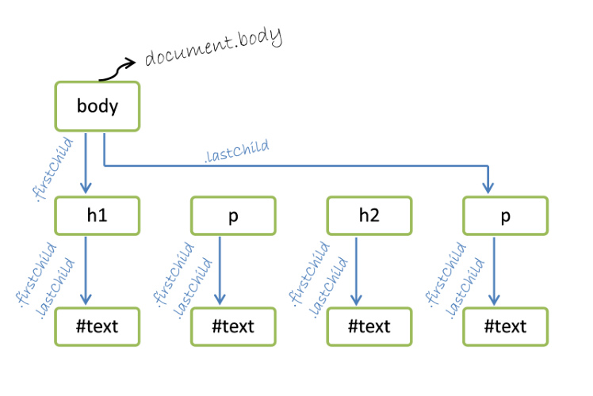
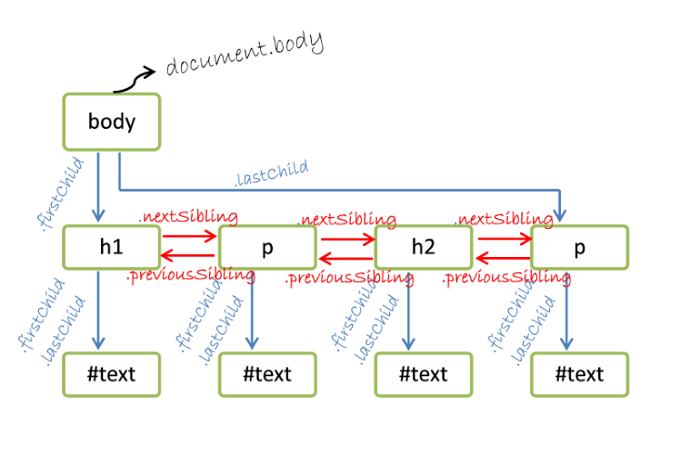
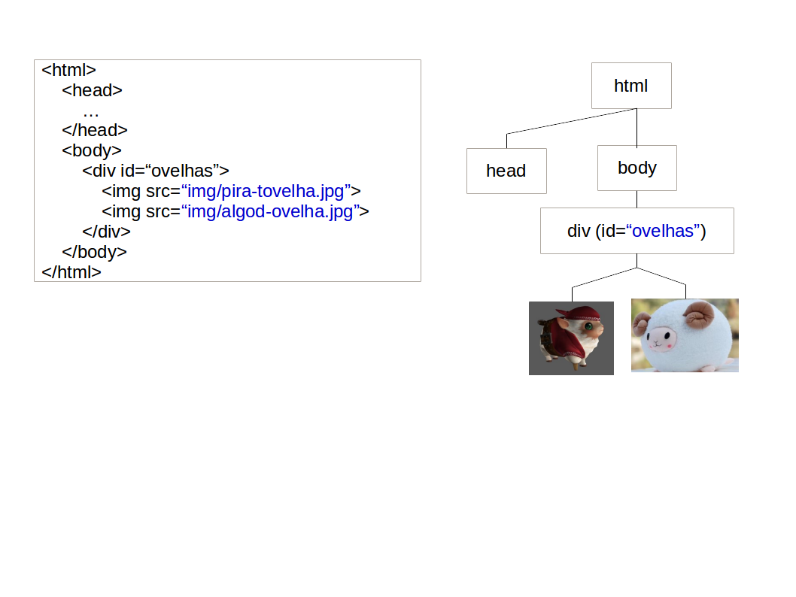
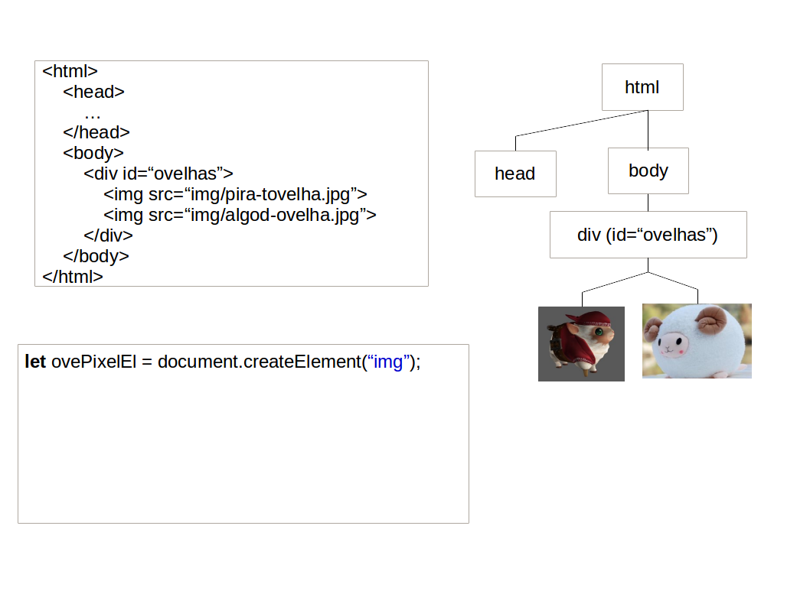
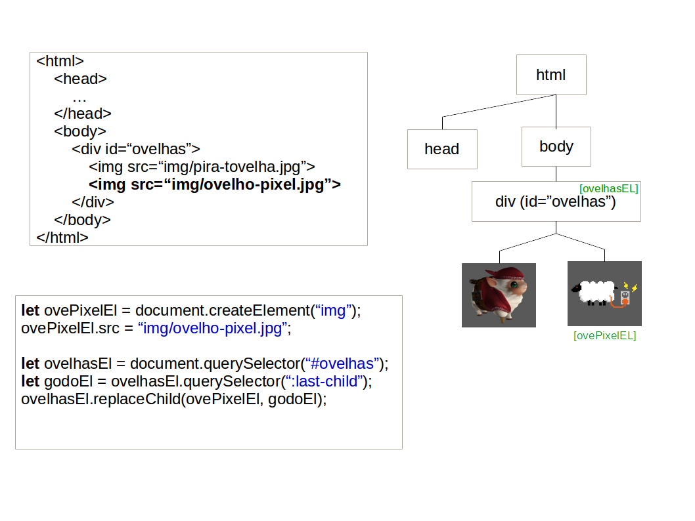
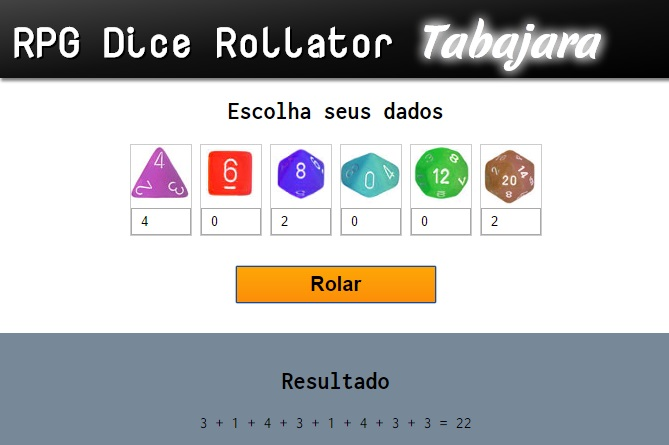

# Javascript - Parte 2

---
# Roteiro de hoje

1. Javascript no navegador
1. O DOM
1. Eventos
1. Exercícios

---
# Javascript no navegador

---
## O objeto global: **window**

- O navegador **expõe um único objeto** por janela (ou por frame, ou por
  iframe) chamado `window`
- Ele possui informações e utilidades sobre a janela (frame, iframe) corrente.
  Exemplos:
  ```js
  window.alert('mensagenzinha feia');  // retorna undefined
  window.confirm('janela pedindo confirmacao'); // true, false
  window.prompt('escreva seu nome, champz', 'b. verde'); // string
  ```
  ```js
  // url, título, opções
  window.open('/popup.html', 'Enquete', 'resizable,scrollbars');
  ```

---
## Momento interativo

- Vamos testar essas funções do objeto `window`
  1. Abra as ferramentas de desenvolvedor do seu navegador (<kbd>F12</kbd>
     ou <kbd>Ctrl+Shift+I</kbd>)
  1. Na aba console, digite `window`, depois ponto ("`.`") e veja a
     quantidade de propriedades do objeto
  1. Execute o comando para abrir uma janela com [a página do pudim](http://pudim.com.br)
     - Se a nova janela não abrir, provavelmente ela foi bloqueada pelo
       navegador ;)

---
## O objeto global: **window** (cont.)

- Mais algumas utilidades de **window**
  ```js
  window.setTimeout(f, 200);   // chama daqui a 200ms, 1x. retorna um id do timer
  window.setInterval(f, 1000); // chama a cada 1s, forever. retorna um id
  window.clearTimeout(id);
  window.clearInterval(id);
  ```
  ```js
  window.eval('window.alert("eval is evil!");');    // nao fazer em casa
  ```

---
## Objetos notáveis dentro de **window**

- Além de utilidades, o objeto `window` também possui outros objetos muito
  importantes
  - **`window.document`**
   - Acesso à estrutura `html` da página
  - `window.navigator`
    - Acesso a características do navegador
  - `window.console`
    - Objeto de acesso à saída de terminal
  - `window.history`
    - Funções de manipulação do histórico da página (botões Voltar/Avançar)

---
## Objetos notáveis dentro de **window** (cont.)

- Mais alguns objetos:
  - `window.Math`
    - **Funções matemáticas**
  - `window.JSON`
    - Funções de conversão entre string e JSON
  - `window.localStorage`
    - _Cache_ de informações locais à página
  - `window.sessionStorage`
    - _Cache_ com duração de apenas uma sessão
  - `window.location`
    - Informações acerca do endereço da página

*[JSON]: JavaScript Object Notation*

---
## Convenção

- Como o objeto `window` é o único objeto que o navegador expõe para os
  scripts, **podemos acessar suas propriedades <u>sem usar `"window."`</u>** :scream:.
  Por exemplo:
  ```js
  window.console.log('Nintendo pwns Sony');
  ```
  É o mesmo que:
  ```js
  console.log('Nintendo pwns Sony');    // sucesso!!
  ```
- Vamos falar muito agora sobre **`window.document`**, ou apenas `document`

---
<!-- {"slideHash": "conhecendo-o-dom"-->
# O DOM

 <!-- {.portrait} -->

---
## O objeto **document**

- O objeto `document` dá acesso ao **Document Object Model**, ou DOM
- O DOM é uma representação da estrutura dos elementos html na forma de
  árvore
  
  <pre style="float:right;width:50%;margin:0;"><code class="hljs lang-html">&lt;!DOCTYPE html&gt;
  &lt;html&gt;
    &lt;head&gt;
      &lt;title&gt;HTML&lt;/title&gt;
    &lt;/head&gt;
    &lt;body&gt;
      &lt;!-- Add your content here --&gt;
    &lt;/body&gt;
  &lt;/html&gt;</code></pre>

---
## DOM

- Cada elemento do DOM é chamado de **nó** (_node_) (estrutura de árvore)
- O tipo de cada elemento "herda" de um tipo chamado `HTMLElement`
- É possível acessar os atributos HTML dos elementos:
  - `id`
    ```js
    console.log(botaoAzul.id);
    ```
  - classes, etc.
    ```js
    console.log(botaoAzul.className); // className equivale a class
                                      // - não pode 'class' pq é reservado em js
    ```

*[DOM]: Document Object Model*

---
<!-- {"backdrop": "old-paper"} -->
## Buscando nós na árvore

- Há diversas formas para se recuperar nós específicos da árvore
  ```js
  document.getElementById(id);    // HTMLElement ou null
  document.getElementsByTagName(nomeDaTag); // HTMLCollection
  document.getElementsByClassName(classe);  // HTMLCollection
  document.getElementsByName(nome);  // HTMLElement ou null
  ```
- Exemplo:
  ```js
  const botaoEl = document.getElementById('botao-compartilhar-no-face');
  botaoEl.onclick = function() { /* ... */ };   // onclick é bem old...
  ```

---
<!-- {"backdrop": "old-paper"} -->
## Buscando nós em uma sub-árvore

- É possível fazer consultas a nós a partir de uma sub-árvore:
  ```js
  no.getElementsByTagName(nomeDaTag);
  no.getElementsByClassName(classe);
  ```
- Exemplo: recuperar todas as imagens com a classe `icone` dentro do menu:
  ```js
  const navegacaoEl = document.getElementById('menu-principal');
  const iconesEl = navegacao.getElementsByClassName('icone');
  ```

---
<!-- {"backdrop": "shiny"}-->
## Buscando nós na árvore  <!-- {style="height: 1em;"}-->

- Existem dois comandos melhores para fazer consultas no DOM:
  ```js
  let iconesNavegacaoEl = document.querySelectorAll('#menu-principal .icone');
  let botaoEnviarEl = document.querySelector('#botao-enviar');
  ```
  - São melhores porque:
    - **Interface unificada** de busca
    - Usa os mesmos **seletores de CSS**
    - Inspirado na biblioteca **jQuery**


---
<!-- {"slideHash": "caminhando"-->
## Caminhando pela árvore

- É possível fazer um caminhamento pela árvore toda ou começando a partir de
  um nó específico
  - Por exemplo: você pode querer visitar todos os nós para excluir textos
    proibidos ('XXX', 'Aécio', 'Dilma', 'calor')
- Se for necessário percorrer a árvore, pode-se usar **apontadores para filhos,
  pais e irmãos de cada nó**
  ```js
  no.firstChild;        // primeiro filho
  no.lastChild;         // último filho
  no.childNodes;        // array de filhos
  no.nextSibling;       // próximo irmão
  no.previousSibling;   // irmão anterior
  no.parentNode;        // nó pai
  ```

---

::: figure .figure-slides
 <!-- {.bullet.figure-step.bullet-no-anim} -->
 <!-- {.bullet.figure-step.bullet-no-anim} -->
 <!-- {.bullet.figure-step.bullet-no-anim} -->
:::

---
## Exemplo: imprimindo o nome das _tags_

```js
function caminhaNoDOM(no, visitaNo) {
  visitaNo(no);
  no = no.firstChild;
  while (no) {
    caminhaNoDOM(no, visitaNo);
    no = no.nextSibling;
  }
}

function imprimeNomeDaTag(no) {
  // apenas imprime o nome da tag (e.g., BODY, H1, P)
  console.log(no.tagName);
}

// chama o algoritmo de caminhamento com a função de visita
// imprimindo o nome da tag corrente
caminhaNoDOM(document.body, imprimeNomeDaTag);
```

---
<!-- {"layout": "regular"} -->
## Criando elementos dinamicamente

- É possível criar elementos dinamicamente, de duas formas:
  1. Definindo a propriedade de **`innerHTML` de um elemento** da árvore
     para **uma string descrevendo uma estrutura HTML** (já vimos):
     ```js
     let listaEl = document.querySelector('#lista-de-dados');
     listaEl.innerHTML = '<li></li>';
     ```
  1. Instanciando elementos e os adicionando ao DOM, que é feito em
     3 passos (detalhados a seguir):
     ```js
     // 1. Solicitamos ao document a criação de um elemento
     // 2. Configuramo-lo (atributos, id, classes etc.)
     // 3. Inserimo-lo na árvore
     ```

---
<!-- {"layout": "regular-block"} -->
# Instanciação de elementos HTML

- A função **document.createElement** cria um elemento HTML
  - Devemos especificar a _tag_ do elemento que iremos criar
- Exemplo - criação de uma imagem:
  ```js
  // 1. Solicitamos ao document a criação de um elemento
  let dadoEl = document.createElement('img');         // cria uma 
  // 2. Configuramo-lo (atributos, id, classes etc.)
  ovelhaEl.src = 'images/ovelho-pixel.png';           // 
  ovelhaEl.classList.add('raca');                     // 
  ```
  - Resultado:
    ```HTML
    
    ```
- **Atenção**: Você **criou** o elemento, porém <u>**ainda não
  o adicionou**</u> na árvore

---
<!-- {"layout": "regular"} -->
## Inserção do elemento na árvore DOM

- Para vincularmos um elemento criado, precisamos conhecer quem será seu
  **pai**
- Logo após, podemos adicionar o elemento usando um dos seguintes comandos:
  1. `appendChild`: será o filho mais à direita
  1. `insertBefore`: será o filho que vem logo antes de outro
  1. `replaceChild`: substituirá um filho existente

```js
let containerEl = document.querySelector('#ovelhas');
let novaOvelhaEl = document.createElement('img');
novaOvelhaEl.src = 'img/ovelho-pixel.png';
containerEl.appendChild(novaOvelhaEl);
```

---
<!-- {"layout": "regular-block", "embeddedStyles": ".create-element img { width: 72%; }"} -->
## Vinculação na árvore DOM com **(1) `appendChild`**

::: figure .figure-slides.create-element.clean
<!-- {.medium-width.bullet.figure-step.bullet-no-anim} -->
<!-- {.medium-width.bullet.figure-step.bullet-no-anim} -->
<!-- {.medium-width.bullet.figure-step.bullet-no-anim} -->
<!-- {.medium-width.bullet.figure-step.bullet-no-anim} -->
<!-- {.medium-width.bullet.figure-step.bullet-no-anim} -->
:::

---
<!-- {"layout": "regular-block"} -->
## Vinculação na árvore DOM com **(2) `insertBefore`**

::: figure .figure-slides.create-element.clean
<!-- {.medium-width.bullet.figure-step.bullet-no-anim} -->
<!-- {.medium-width.bullet.figure-step.bullet-no-anim} -->
<!-- {.medium-width.bullet.figure-step.bullet-no-anim} -->
:::

---
<!-- {"layout": "regular-block"} -->
## Vinculação na árvore DOM com **(3) `replaceChild`**

::: figure .figure-slides.create-element.clean
<!-- {.medium-width.bullet.figure-step.bullet-no-anim} -->
<!-- {.medium-width.bullet.figure-step.bullet-no-anim} -->
<!-- {.medium-width.bullet.figure-step.bullet-no-anim} -->
:::

---
## Resumindo: `appendChild`, `insertBefore` e `replaceChild`


<!-- {.medium-width.centered} -->

---
<!-- {"layout": "regular-block"} -->
## **Inserindo texto** nos elementos

- Podemos colocar texto nos elementos de 2 formas:
  1. Usando `document.createTextNode('texto aqui')`:
     ```js
     let bodyEl = document.querySelector('body');
     let pEl = document.createElement('p');
     let txtEl = document.createTextNode('Olá parágrafo!'); // <--
     bodyEl.appendChild(pEl);                   // põe o parágrafo em <body>
     pEl.appendChild(txtEl);                    // põe o texto no <p>
     ```
  1. Usando `elemento.innerHTML`:
     ```js
     let bodyEl = document.querySelector('body');
     let pEl = document.createElement('p');
     bodyEl.appendChild(pEl);                   // põe o parágrafo em <body>
     pEl.innerHTML = 'Olá parágrafo!';          // define o innerHTML do <p>
     ```

---
<!-- {"layout": "regular-block", "slideHash": "remocao-de-elementos"} -->
# Remoção de Elementos

- Usamos `containerEl.removeChild` ou, para remover todos, `innerHTML`:
  ```html
  <main>
    
  </main>
  ```
  ```js
  let mainEl = document.querySelector('main');
  let imgEl = document.querySelector('#urso');

  mainEl.removeChild(imgEl);      // remove a 
  // ou...
  mainEl.innerHTML = '';          // remove tudo o que estiver em <main></main>
  ```
---
## Alterando atributos dos nós

- É possível alterar atributos dos nós:
  ```html
  <a href="/contato" title="" id="link-contato">
  ```
  ```js
  let lingua = 'port';
  const texto = {
    'port': 'Página de Contato',
    'ingl': 'Contact Us'
  }
  const linkContatoEl = document.getElementById('link-contato');
  linkContatoEl.title = texto[lingua];
  ```

---
## Alterando o estilo de elementos

- Há 2 formas para alterar o estilo de elementos:
  1. Alterando a propriedade `style`:
     ```js
     botaoEl.style.width = '80%';           // define largura como 80%
     botaoEl.style.paddingTop = '2px';      // padding-top vira paddingTop
     ```
  1. Adicionando ou removendo classes :thumbsup::thumbsup::
     ```js
     botaoEl.classList.add('selecionado');  // adiciona .selecionado
     botaoEl.classList.remove('oculta');    // remove .oculta
     ```

---
## Nomes das propriedades de estilo em JS

- Repare a mudança das propriedades **CSS para JS**:
  ```js
  botao.style.backgroundColor = '#ccc';
  ```
- CSS &#8594; Javascript
  - `background-color` &#8594; `backgroundColor`
  - `border-radius` &#8594; `borderRadius`
  - `font-size` &#8594; `fontSize`
  - `list-style-type` &#8594; `listStyleType`
  - `z-index` &#8594; `zIndex`

---
# Eventos

---
## Eventos

- Eventos são **atrelados a nós específicos** e causam a invocação de uma função
  "manipuladora" (_event handler_ ou apenas _handler_)
- Eventos de mouse:
  - `click`
  - `dblclick`
  - `mousedown`
  - `mouseup`
  - `mousemove`
  - `mouseover`
  - `mouseout` <!-- {ul:.multi-column-list-4}-->
- Eventos de entrada de dados:
  - `change`
  - `blur`
  - `focus`
  - `keydown`
  - `keyup`
  - `reset`
  - `submit` <!-- {ul:.multi-column-list-4}-->
- (Muitos) outros tipos: [Eventos na MDN](https://developer.mozilla.org/en-US/docs/Web/Events)

---
## _Event handlers_

- Há 2 formas de atribuir _handlers_ a eventos
  - Forma clássica (e feia :thumbsdown:)
    ```js
    button.onclick = function(e) { /*...*/ };
    ```
    - Foi a única forma por muitos anos
    - Permite apenas um _handler_ por tipo de evento
  - Forma bacana :thumbsup::
    ```js
    button.addEventListener('click', function(e) { /*...*/ });
    ```

---
# Eventos: tópicos avançados

---
## _Event Bubbling_ (Borbulhas de Amor)

- Quando um evento é disparado em um elemento (e.g., clique), não apenas ele
  mas **os _handlers_ do mesmo tipo <u>de todos os ancestrais do elemento</u>
  também são acionados**
- Isso é chamado de **_event bubbling_**
- Exemplo vivo: [http://jsfiddle.net/76hf9usa/1/](http://jsfiddle.net/76hf9usa/1/)
  - Repare que há 3 `divs`, uma dentro da outra e cada uma tem um
    _click handler_

<!---
## Por que borbulhar?

- Considere que você tem 100 objetos arrastáveis (_drag'n'drop_)
  - Você pode colocar um _handler_ em cada um (100x)
  - Ou você pode colocar o _handler_ no container deles (1x) e usar a informação
    do evento (`evt.target`) para saber qual objeto arrastável foi clicado

-->
---
## Cancelando a bolha

- Um _handler_ deve cancelar o borbulhamento do evento caso queira que ele pare
  de borbulhar. Utiliza-se `e.stopPropagation()`:
  ```js
  function fechaPainelModal(e) {
    // "fecha" (torna invisível) o painel modal
    modal.style.display = 'none';
    // evita que o clique no botão fechar seja processado pelos
    // handlers de cliques dos elementos ancestrais  
    e.stopPropagation();
  }
  botaoFechar.addEventListener('click', fechaPainelModal);
  ```
- Exemplo vivo: [http://jsfiddle.net/fegemo/r61r5sLy/3/](http://jsfiddle.net/fegemo/r61r5sLy/)

---
## Impedindo a ação padrão

- Elementos de entrada (`input`) e alguns outros elementos possuem
  **ações padrão**. Por exemplo:
  - Botão `submit` &#8594; envia o formulário
  - Botão `reset` &#8594; limpa os campos preenchidos
- É possível cancelar a ação padrão usando `e.preventDefault()`:
  ```js
  function validaFormulario(e) {
    if (nome === '' || senha === '') {
      // Houve erros no formulário. Impedir o envio
      e.preventDefault();
    }
  }
  botaoEnviarEl.addEventListener('submit', validaFormulario);
  ```

---
# Exercícios

- Hoje temos 2 atividades práticas:
  1. Exploração Espacial :alien: (obrigatória)
  1. RPG Dice Rollator _Tabajara_ :game_die: (em sala)

---
<!-- {"backdrop": "space"} -->
---
## Atividade 1: Exploração Espacial :alien:

- Crie a página da **Exploração Espacial** :alien:
  - [Repositório no GitHub](https://github.com/daniel-hasan/cefet-web-space)
    para fazer seu _fork_
- Há 2 exercícios:
  1. Você deve criar um código em Javascript para **fazer os botões "+"
     expadirem ou retrairem o texto dos parágrafos**
     - Fazer no arquivo `exercicio1.js`
  1. Criar uma **galeria** mostrando **fotos e imagens** da sonda Philae
     - Fazer no arquivo `exercicio2.js`

---
## Atividade 2: <span style="font-family: monospace">Dice Rollator <span style="font-family: cursive">Tabajara</span></span>



---
## Atividade 2 - <span style="font-family: monospace">Dice Rollator <span style="font-family: cursive">Tabajara</span></span> (cont.)

- Crie o _Dice Rollator Tabajara_, um sistema de rolagem de dados
  - [Repositório no GitHub](https://github.com/fegemo/cefet-web-dice-rollator)
    para fazer seu _fork_
  - Fazer no arquivo `principal.js`
- Há dados de 4, 6, 8, 10, 12 e 20 lados
- O usuário escolhe a quantidade de dados que quer jogar, de cada tipo
- Ao apertar o botão "Rolar", os resultados devem aparecer na parte de baixo da
  página

---
## Dicas para o Dice Rollator

- Você não precisa fazer nenhuma alteração nos arquivos CSS e HTML, apenas no
  arquivo JavaScript
- Para obter um número aleatório entre 0 e 1:
  ```js
  let resultado = Math.random();
  ```
  - Para obter um número inteiro, de 1 a `maximo`:
    ```js
    let resultado = Math.ceil(Math.random() * maximo);
    ```

---
# Referências

- Livro "Javascript: The Good Parts" (Douglas Crockford)
- [Mozilla Developer Network](https://developer.mozilla.org/)
