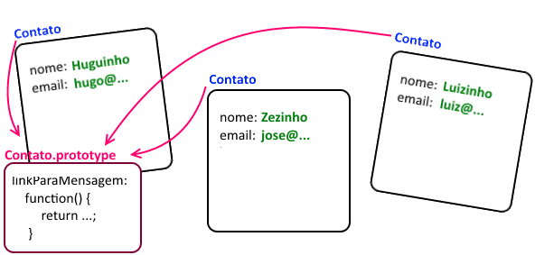
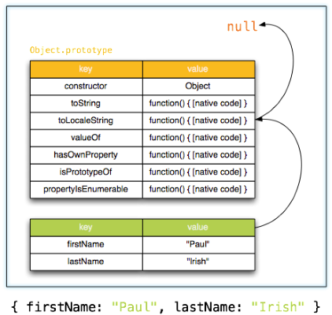

<!-- {"layout": "title"} -->
# Javascript - Parte 3
## Funcionamento e Padrões de Projeto

---
# Roteiro

1. Criando objetos
1. Funções construtoras
1. Herança
   - Pseudo-clássica
   - Com classes
1. Padrões de projeto
   - `this`, `that`
   - _`new` enforcer_
   - IIFE

*[IIFE]: Immediately Invoked Function Expression*

---
## Java (ou C#) _vs_ JavaScript

| Java              | JavaScript        |
|-------------------|-------------------|
| Fortemente tipada | Fracamente tipada |
| Estática          | Dinâmica          |
| Clássica          | Prototípica       |
| Classes           | Funções           |
| Construtores      | Funções           |
| Métodos           | Funções           |

---
# Criando Objetos

---
## Instanciação de Objetos

- Como visto, JavaScript possui 01 tipo de dados complexo `Object`
- Podemos instanciar objetos de duas formas:
  1. Forma **literal**:
     ```js
     let carro = {};
     ```
  1. Operador `new`:
     ```js
     let carro = new Object();
     ```

---
## Instanciação de Objetos (cont.)

- Um objeto é simplesmente um _container_ de propriedades (nome: valor)
  ```js
  let carro = {
    cor: 'vermelho',
    codigoCor: '#ff0000',
    fabricante: {
      nome: 'Fiat',
      origem: 'Itália'
    }
  };
  ```

---
## Acesso a propriedades

- Para acessar propriedades de objetos, também há duas formas:
  1. Via **notação `.`**:
     ```js
     console.log(carro.cor);    // vermelho
     ```
  1. Via **indexação** (como em um _array_):
     ```js
     console.log(carro['cor']); // vermelho
     ```
     - Em termos de LP, temos **reflexão** de graça :)
- Acesso a propriedades inexistentes retorna `undefined`:
  ```js
  console.log(carro.potencia);  // undefined (prop. potencia não existe)
  ```

---
## Acesso a propriedades (cont.)

- O operador  `||` pode ser usado para a definição de valores padrão:
  ```js
  let potencia = carro.potencia || 1000;
  ```
- Tentativa de acesso de propriedades de um valor `undefined` dá erro:
  ```js
  console.log(carro.potencia);                          // undefined
  console.log(carro.acessorios.volante);                // lança "TypeError"
  ```
- O erro pode ser prevenido usando-se o operador `&&`:
  ```js
  console.log(carro.acessorios && carro.acessorios.volante);  // undefined
  ```

---
## Alterando propriedades

- Para alterar o valor de uma propriedade já existente, usamos o operador
  de atribuição (`=`)
  ```js
  carro.cor = 'verde';      // carro.cor era 'vermelho'
  ```
- Para **criar uma nova propriedade**, usamos o operador de atribuição
  **da mesma forma**:
  ```js
  carro.peso = 900;         // carro.peso não existia, mas agora é 900
  ```

---
## Referências a objetos

- Objetos são "transportados" por referência e nunca copiados
  ```js
  let outroCarro = carro;
  outroCarro.cor = 'prata';
  console.log(carro.cor);       // prata
  ```
  ```js
  let a = {}, b = {}, c = {};
  console.log(a == b);          // false
  console.log(b == c);          // false
  console.log(a == c);          // false
  ```

---
## Construção de objetos por **construtor**

- Existe uma terceira forma, em que podemos criar e inicializar o objeto.
  Nessa forma, criamos uma **função construtora** que vai instanciar e
  inicializar objetos:
  ```js
  function Moto(modelo, dono) {
    this.modelo = modelo;         // Lembre que 'this' dentro de um
    this.dono = dono;             // objeto aponta para ele mesmo
  }
  let moto1 = new Moto('Kawasaki', 'Ninja Jiraya');
  let moto2 = new Moto('Harley Davidson', 'Lula Molusco');
  ```

---
## Construção de objetos por **construtor** (cont.)

- Uma função construtora (ou **construtor**) é apenas uma função.
  - Porém ela usa a referência `this` para definir propriedades de um
    objeto novinho que está sendo criado
  - Tipicamente, **o nome de toda função construtora começa com letra
    maiúscula** (convenção). _E.g._:
    ```js
    function Leguminosa(nome, calorias) {   // legal!
      // this.nome = nome
      // ...
    }
    function verdura(nome, calorias) {   // funciona, mas evite
      //...
    }
    ```

---
## Construção de objetos por **construtor** (cont.)

- Se, além de propriedades de dados (`modelo`, `dono` etc.), colocarmos também
  alguns métodos, podemos falar que temos algo muito semelhante a uma
  **classe** das linguagens OO "tradicionais"
  ```js
  function Moto(modelo, dono) {
    /* ... */
    this.toString = function() {
      return this.modelo + ' do(a) ' + this.dono;
    };
  }
  let motoca = new Moto('Honda Biz', 'Rubinho');
  console.log(motoca.toString());     // Honda Biz do Rubinho
  ```

---
## Exemplo: Lista de contatos

- Considere um código para inicializar uma lista de contatos assim:
  ```js
  function Contato(nome, email) {
    this.nome = nome;
    this.email = email;
    this.linkParaMensagem = function() {
      return 'mailto:' + this.email;
    };
  }

  // continua no próximo slide
  ```

---
## Exemplo: Lista de contatos (cont.)

- (continuando o código...)
  ```js
  const lista = [
    new Contato('huguinho', 'hugo@gmail.com'),
    new Contato('zezinho', 'jose@gmail.com'),
    new Contato('luizinho', 'luiz@gmail.com')
  ];
  ```

---
## Exemplo: Lista de contatos (cont.)

- Se pudéssemos examinar a memória alocada, veríamos:

  
  - Repare que o código do método é repetido a cada instância
    - Podemos melhorar isso, se tivermos como definir **o método
      `linkParaMensagem` a nível da classe**, ao invés de fazê-lo
      na instância

---
## Exemplo: Lista de contatos (cont.)

- De fato, é possível definir um **método a nível da classe** usando uma
  propriedade chamada `prototype`:
  ```js
  function ContatoV2(nome, email) {
    this.nome = nome;
    this.email = email;
  }
  ContatoV2.prototype.linkParaMensagem = function() {
    return 'mailto:' + this.email;
  };
  // lembre-se: função é um objeto, logo, pode ter propriedades
  ```

---
## Exemplo: Lista de contatos (cont.)

- Se usarmos a classe `ContatoV2` para alocar a lista de contatos, teremos:

  
  - Mas como isso funciona?

---
## O **Prototype** (protótipo)

- Todo objeto possui uma propriedade especial chamada `prototype` de onde ele
  **pode herdar propriedades**
  - Podemos visualizar isso ao criarmos um objeto vazio e verificar que ele já
    tem algumas propriedades:
    ```js
    let novo = {};
    console.log(novo.toString());     // [object Object]
    ```
    - Isso acontece porque todo objeto que instanciamos na forma literal
      tem seu `prototype` apontado para um objeto que possui algumas
      propriedades (e.g., `toString`)

---
## O **Prototype** (cont.)



---
## Métodos de classe (estáticos)

- É possível definir um método (propriedades em geral) que pertence à classe e
  não tem acesso aos dados das instâncias (similar ao método estático de Java):
  ```js
  ContatoV2.ordenarContatos = function() { /* ... */ };
  ```
  - É diferente do **método a nível de classe**
    ```js
    ContatoV2.prototype.linkParaMensagem = function() { };
    ```

---
# Funções Construtoras (classes)

---
## Funções em Javascript (recordando)

- Funções são objetos (invocáveis)
- Definimos na forma literal:
  ```js
  function fibonacci(n) {
    return n < 3 ? 1 : fibonacci(n-1) + fibonacci(n-2);
  }
  ```
  - Possui 4 partes:
    1. A palavra `function`
    1. Um nome (opcional em certos casos)
    1. Lista de parâmetros
    1. Corpo

---
## Prototype

- Sendo objetos, as funções também possuem uma propriedade `prototype` que
  aponta para um objeto "global", o `Function.prototype`

---
## Invocação de funções (como função)

- Há 4 formas distintas para se invocar uma função
  1. Como uma função: `iniciaControlesVideo()`
  1. Como um método: `video.play()`
  1. Como um construtor `new VideoPlayer()`
  1. Com `apply` ou `call`: `iniciaControlesVideo.call(null)`
- Informação **insanamente** importante:
  - O objeto para onde `this` aponta varia em cada uma das 4 formas

---
## (1) Invocação de funções (como **função**)

1. Como uma **função** propriamente dita, ou uma **subrotina**:
   - Quando a função não está associada a um objeto
     ```js
     function soma(a, b) {
       return a + b;
     }
     soma(40, 2);      // invocação. Retorna 42
     let s = soma;
     s(21, 21);        // invocação. Retorna 42
     ```
     - O valor de `this` é **sempre** definido para o objeto global `window`
       - Isto foi um erro de projeto da linguagem :worried:

---
## (2) Invocação de funções (como **método**)

2. Como um **método** (função que pertence a um objeto):
   - Quando a função é uma propriedade de um objeto
     ```js
     let contador = {
       valor: 0,
       incrementa: function(qtde) {
         this.valor += qtde ? qtde : 1;
       }
     }
     contador.incrementa();    // contador.valor = 1
     contador.incrementa(10);  // contador.value = 11
     ```
     - `this` aponta para a instância do objeto dono do método invocado

---
## Invocação de funções (como **método** vs **função**)

- Uma consequência do erro de projeto mencionado:
  ```js
  let calculadora = {
    valor: 1,
    multiplica: function(fator) {           // invocação de método
      const soma = function(parcela) {      // invocação de função
        this.valor += parcela;              // `this` aponta para `window`
      }
      let incremento = this.valor;
      for (; fator !== 1; fator--) { soma(incremento); }
    }
  };
  calculadora.multiplica(5);          // 1 x 5; mas calculadora.valor = 1. Pq?
  ```

---
## Invocação de funções (**método** vs **função** cont.)

- O que aconteceu no exemplo anterior:
  - O valor de `this` dentro de `calculadora.multiplica` aponta para a
    instância do objeto calculadora, como esperado
  - Porém, dentro de `soma`, `this` passa a apontar para `window`, que não tem
    uma variável `valor`
- Mas não desanime: dá pra consertar! E de duas formas:
  1. Padrão de projeto: `this, that`
  1. ES2015: _arrow functions_

---
## (a) Padrão de projeto: **this**, **that**

- Para resolver o problema, podemos salvar a referência de `this` que aponta
  para a instância da calculadora e usá-la em `soma`:
  ```js
  let calculadora = {
    valor: 1,
    multiplica: function(fator) {
      let that = this, incremento = this.valor;
      let soma = function(parcela) {
        that.valor += parcela;  // that aponta para a instância da calculadora
      }
      for (; fator !== 1; fator--) { soma(incremento); }
    }
  };
  ```

---
## (b) ES2015: _arrow functions_

- No ES2015 foram propostas as _arrow functions_, que mantêm o valor de `this`
  do contexto externo, dentro da função:
  ```js
  let calculadora = {
    valor: 1,
    multiplica: function(fator) {
      let soma = (parcela) => {         // omite o "function" e tem o =>
        this.valor += parcela;          // mantém o valor de this que estava do
      }                                 //   lado de fora
      let incremento = this.valor;
      for (; fator !== 1; fator--) { soma(incremento); }
    }
  };
  ```

---
## (3) Invocação de funções (como **construtor**)

3. Quando uma função é invocada, **precedida pelo operador `new`**, dizemos que
   a função é um **construtor**:
   ```js
   function Contato(nome) {
     this.nome = nome;
   }
   let presidente = new Contato('Seu Adamastor');  // construtor
   ```
   - Por causa do **operador `new`, três coisas acontecem**:
     1. Um **objeto "em branco"** é criado e seu **`prototype` é o mesmo do
       da função**
     1. O valor de **`this`** dentro da função **aponta para o novo objeto**
     1. Se não houver `return`, **`this` é retornado** automaticamente

---
## _Caveat_ da invocação por **construtor**

- Se uma função construtora é invocada sem o `new`, _shit will happen_
  - Veja por quê:
    ```js
    function Contato(nome) {
      this.nome = nome;
    }
    let presidente = Contato('Seu Custódio');   // invoc. função
    ```
    - Ao final do código acima, temos que:
      1. `window.nome === "Seu Custódio"`
      1. `presidente === undefined`

---
## Padrão de projeto: **new enforcer**

- Podemos **detectar** se o construtor foi invocado **sem o `new`** e
  então reinvocar o construtor adequadamente:
  ```js
  function Contato(nome) {
    if (this === window) {
      return new Contato(nome);
    }
    this.nome = nome;
  }
  ```
  - Simplão!

---
## Invocação de funções (com **apply ou call**)

- `Function.prototype` tem dois métodos chamados `apply` e `call`
  - Ou seja, toda função tem acesso a eles
- Os dois métodos possibilitam a invocação da função usando um **valor
  arbitrário para `this`** e um **conjunto de argumentos**
  - Exemplos:
    ```js
    function ola(nome, profissao) {
      return 'Me chamo ' + nome + ' e sou ' + profissao;
    }
    ola('Joao', 'Storm Trooper');             // invocação como função (subrotina)
    ola.apply(null, ['Alex', 'Rebelde']);     // apply: argumentos em um vetor
    ola.call(null, 'Astolfo', 'Sith');        // call: argumentos separados por ,
    ```

---
## Uso interessante de **apply** ou **call**

- [_Monkey-patching_](http://en.wikipedia.org/wiki/Monkey_patch): incluir um
  comportamento a uma função existente sem prejudicar seu funcionamento
    ```js
    // Código legítimo de um site:
    let carrinho = {
       adicionarProduto: function(idProduto, qtde, preco) { /* ... */ }
    };

    // Código do malvado programador JavaScript *no console*:
    let original = carrinho.adicionarProduto;
    carrinho.adicionarProduto = function(id, qtde, preco) {
      original.call(carrinho, id, qtde, 0.05);    // U.U
    }
    ```

---
# Herança

---
## Forma **pseudo-clássica**

```js
let Mamifero = function(nome) {
  this.nome = nome;
};

Mamifero.prototype.diz = function() {
  return this.fala || '';
};
```
```js
let mamiferoGenerico = new Mamifero('mamifero');
mamiferoGenerico.diz();     // retorna ''
```

---
## Forma **pseudo-clássica** (cont.)

```js
let Gato = function(nome) {
  this.nome = nome;
  this.fala = 'Miau';
}
Gato.prototype = new Mamifero();
```
```js
let gato = new Gato('Tom');
gato.diz();                 // retorna 'Miau'
```

---
<!-- {"layout": "2-column-content"} -->
# Classes em <small>(ES5)</small> vs **<small>(ES2015)</small>**

```js
function Veiculo(marca, tipo) {
  this.marca = marca;
  this.tipo = tipo;
}

Veiculo.prototype
  .ligar = function(opcoes) {
  //...  
};
new Veiculo('Ford', 'Ka');
```
```js
class Veiculo {
  constructor(marca, tipo) {
    this.marca = marca;
    this.tipo = tipo;
  }
  ligar(opcoes) {
    //...
  }
}
new Veiculo('Ford', 'Ka');
```

---
## Herança de Classes <small>(ES5)</small>

```js
function Carro(marca, tipo, modelo) {
  Veiculo.call(this, marca, tipo);
  this.modelo = modelo;
}

Carro.prototype = Object.create(Veiculo.prototype);
Carro.prototype.ligar = function(opcoes) {
  Veiculo.prototype.ligar.call(this, opcoes);
  // fazer coisas específicas de um carro
}
```

---
## Herança de Classes <small>(**ES2015**)</small>

```js
class Carro extends Veiculo {
  ligar(opcoes) {
    super.ligar(opcoes);
  }
}
```

---
## Classes em ES6

- Prós
  - Classes tornam mais **fácil para novatos começarem** a usar JavaScript
  - Ter um **mecanismo de herança com suporte da linguagem**
  - Sintaxe **clara e expressiva**
  - Previne que o programador esqueça do `new` ao usar uma função construtora
- Contras
  - Não há controle de privacidade (`private`, `protected`) ainda

---
# Escopo

---
## Problema de escopo em Javascript

- Variáveis criadas com `var` possuem escopo de função
- Aquelas criadas fora de uma função são associadas ao objeto `window` (!!!)
  ```html
  <script>
    var umBoizinho = 'verde';
    console.log(window.umBoizinho);   // verde
  </script>
  ```
- Isso causa uma grande **poluição do escopo global**

---
## Resolvendo a poluição

- Podemos criar funções com o único objetivo de não sujar o escopo global
- Vamos colocar o código dentro de uma função e executá-la imediatamente
  - Este é o padrão de projeto IIFE: **Immediately Invoked Function Expression**

*[IIFE]: Immediately Invoked Function Expression*

---
## Padrão de Projeto: IIFE

- Tentativa 1:
  ```html
  <script>
    function a() {
      var umBoizinho = 'verde';
      console.log(window.umBoizinho);   // undefined
    }
    a();
  </script>
  ```
  - Problema: já melhorou, mas ainda poluímos com `a`

*[IIFE]: Immediately Invoked Function Expression*

---
## Padrão de Projeto: IIFE (cont.)

- Tentativa 2, certeira:
  ```html
  <script>
  (function() {
    var umBoizinho = 'verde';
    console.log(window.umBoizinho);   // undefined (yay)
  })();
  </script>
  ```


*[IIFE]: Immediately Invoked Function Expression*

---
# Referências

1. Capítulos 3, 4 e 5 do livro "Javascript: The Good Parts"
1. Capítulos 9 e 10 do livro "Head First: JavaScript"
1. Mozilla Developer Network (MDN)
1. [Como prototypes funcionam](http://yehudakatz.com/2011/08/12/understanding-prototypes-in-javascript/)
1. [Entendendo prototypes](http://javascriptweblog.wordpress.com/2010/06/07/understanding-javascript-prototypes/)
