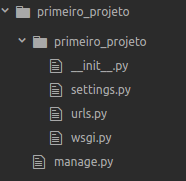

<!-- {"layout": "title"} -->
# Python e Django
## Sintaxe Python: Herança, métodos e import. Django: visão geral e uso do Models
---
<!-- {"layout": "section-header", "slideHash": "classes"} -->
# Mais sobre sintaxe
## Herança e Métodos abstratos e estáticos

- Heraça
- `@classmethod` e `@staticmethod`
- import
---
# Herança
```python
class Pessoa():
  def __init__(self, nome):
    self.nome = nome
  def __str__(self):
    return "Nome: "+self.nome

class Funcionario(Pessoa):
  def __init__(self,nome,salario):
    super().__init__(nome)
    self.salario = salario

  def __str__(self):
    return super().__str__()+" Salario R$ "+str(self.salario)
```
---
## Metodos estáticos e de classe
```python
class Pessoa():
  @staticmethod
  def x():
    print("Oi")
  @classmethod
  def y(cls):
    print(str(cls))
class Funcionario(Pessoa):
  pass
```
- **cls**: classe que foi invocada em tempo de execução:
```shell
>>> Funcionario.y()
<class '__main__.Funcionario'>
>>> Pessoa.y()
<class '__main__.Pessoa'>
```
---
```python
class Pessoa():
  def __init__(self,nome):
    self.nome = nome
  @classmethod
  def instancia_pessoas(cls,n):
    pessoas = []
    for i in range(n):
      pessoas.append(cls("Pessoa "+str(i)))
    return pessoas
class Funcionario(Pessoa):
  pass
```
- Instancia pessoas ou funcionarios, dependendo de qual classe chamada:
```shell
>>> Funcionario.instancia_pessoas(2)
[<__main__.Funcionario object at 0x7fe7f773ac88>, <__main__.Funcionario object at 0x7fe7f773acc0>]
>>> Pessoa.instancia_pessoas(2)
[<__main__.Pessoa object at 0x7fe7f773aba8>, <__main__.Pessoa object at 0x7fe7f773add8>]
```
---
<!-- {"layout": "section-header", "slideHash": "django"} -->
# Django
## Introdução e Modelos

- Projetos vs Aplicações
- Iniciando um projeto
- Criação do Modelo de BD

---
## Django

- Framework Web, possui:
  - artefatos para o desenvolvimento de aplicações web de forma **rápida** e **segura**
  - Mapeamento Objeto-Relacional
- Este possui:
  - **projeto**: Um conjunto de configurações, templates, e outros códigos para sua aplicação rodar
  - Dentro do projeto, várias **aplicações**: conjunto de funcionalidades correlacionadas que podem ser reusadas ao longo do código

---
# Iniciando um **projeto**:
```
django-admin.py startproject primeiro_projeto
```
:::result
<br>


:::
---
- Iniciando um **app** do projeto
```
cd primeiro_projeto
django-admin startapp app_projeto
```
:::result

:::
---
## Models

- Colocamos no arquivo `models.py` o modelo que será salvo no Banco de Dados.
Para criarmos o modelo, no arquivo `models.py`:
- Representamos o modelo por **classes**
- Seus os atributos e seus relacionamos são modelados como **atributos estáticos** da classe
- Configuramos, no arquivo `settings.py`, a conexão com o Banco de Dados
- Executamos um comando para criar as tabelas/relacionamentos  no Banco de Dados

-
---
# Models - Exemplo completo (1/2)

```python
class Blog(models.Model):
    nome = models.CharField(max_length=100)
    sobre = models.TextField()

    def __str__(self):
        return self.nome

class Author(models.Model):
    nome = models.CharField(max_length=200)
    email = models.EmailField()

    def __str__(self):
        return self.name
```
---
# Models - Exemplo completo (2/2)
```python
class Post(models.Model):
    blog = models.ForeignKey(Blog, on_delete=models.CASCADE)
    titulo = models.CharField(max_length=255)
    texto = models.TextField()
    data_publicacao = models.DateField()
    autores = models.ManyToManyField(Author)
    rating = models.IntegerField()

    def __str__(self):
        return self.headline
```
---
# Models - Comandos uteis
- Criar o script python para criação/alteração das tabelas: `python3 manage.py makemigrations`
- Executar os scripts que ainda não foram executados para criação/alteração das tabelas: `python3 manage.py migrate`
---
# Models - Tesouro
```python
class Tesouro(models.Model):
    nome = models.CharField(max_length=45)
    quantidade = models.IntegerField()
    valor = models.DecimalField(max_digits=10,decimal_places=2)
    img_tesouro = models.ImageField(upload_to="imgs")

    def __str__(self):
        return self.nome+" quantidade: "+str(self.quantidade)+\
                " R$ "+str(self.valor)+" "+str(self.img_tesouro)
```

---
# Models - Configuração

Abra o console python com o ambiente do DJango já configurado:
```
python3 manage.py shell
```


Importe todos a classe do Tesouro:
```
from app_projeto.models import Tesouro
```
---
# Models - Inserção

```python
  t1 = Tesouro(nome="Moedas de ouro",quantidade=4,\
              valor=2.4,img_tesouro="moedas.png")
  t1.save()
  Tesouro.objects.create(nome="Barril de rum",\
                        quantidade=3,valor=343,img_tesouro="rum.png")
  Tesouro.objects.bulk_create([\
                Tesouro(nome="Coroa",quantidade=1,\
                        valor=23.2,img_tesouro="coroa.png"),\
                Tesouro(nome="Calice",quantidade=3,\
                        valor=13.2,img_tesouro="calice.png")\
                        ])
```
---
# Models - busca
- Busca todos os registros:
```python
lista = Tesouro.objects.all()
```
- Busca apenas um registro (Caso não encontre o registro, é retornado erro):  
```python
t = Tesouro.objects.get(nome="Coroa")
```
- Busca um registro, caso não exista, o cria
```python
t = Tesouro.objects.get_or_create(nome="Coroa Linda",quantidade=1,\
                                  valor=23.2,img_tesouro="coroa.png")
```
---
## Models busca (usando filtros)
```python
lista = Tesouro.objects.filter(nome="Coroa",quantidade=1)
Post.objects.filter(data_publicacao__year=2006)
```
- Busca por iniciais
```python
lista = Tesouro.objects.filter(nome__startswith="Coroa",quantidade=1)
```
  - Outros operadores de string: `istartswith`,`endswith`, `iendswith`, `icontains`, `iexact`

- Tesouros com valor menor que R$ 10: `lista = Tesouro.objects.filter(valor__lt=10)`
  - Outros operadores: `lte`: <=;  `gt`: <; `gte`:<=

---
## Models busca (usando filtros)
- Todos exceto um determinado elemento:
```python
lista = Tesouro.objects.exclude(nome__startswith="Coroa")
```
- Concatenando filtros: Dos tesouros que não começam com coroa, aqueles que possuem um valor menor que 10:
```python
lista = Tesouro.objects.exclude(nome__startswith="Coroa")\
                        .filter(valor__lt = 10)
```
----
## Outros comandos
- Limitar as 3 primeiras linhas:
```python
lista = Tesouro.objects.all()[:3]
```

- Do resultado na posição 2 **do vetor** até a posição 5:
```python
lista = Tesouro.objects.all()[2:5]
```
- Filtros com outros Campos (valor menor que a quantidade):
```python
from django.db.models import F
lista = Tesouro.objects.filter(valor__lt = F('quantidade'))
```
---
## Models - agregações e anotações
- Campos calculados:
```python
from django.db.models import F,ExpressionWrapper,DecimalField
lista = Tesouro.objects.annotate(total=ExpressionWrapper(F('valor')*F('quantidade'),\
                            output_field=DecimalField(max_digits=10,\
                                                    decimal_places=2,\
                                                     blank=True)\
                                                    )\
                            )
```
- Agregações:
```python
from django.db.models import Count
Autor.objects.annotate(Count('post'))
```
---
## Models - projeções
- Exibir apenas o nome e a quantidade:
  ```python
  lista = Tesouro.objects.all().values("nome","quantidade")
  ```
  - usar `values_list` para exibir no formato de vetor (e não dicionário)
  - ao final, use  `distinct()` para eliminar elementos repetidos
---
## Exclusões e atualizações
```python
#atualiza o tesouro com nome 'coroa'
t = Tesouro.objects.get(nome="Coroa")
t.quantidade = 10
t.save()
```
- Use `.delete()` no final da consulta para deletar os elementos da determinada consulta
```python
Tesouro.objects.get(nome="Coroa").delete() #deleta elemento de nome "Coroa"
Tesouro.objects.filter(valor__lt=10).delete() #deleta elementos de valor menor que 10
Tesouro.objects.all().delete() #deleta todos os elementos
```
---
# Referências

1. https://docs.djangoproject.com
