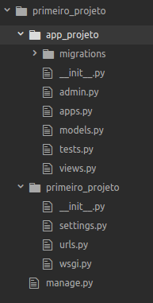

<!-- {"layout": "title"} -->
# Django Templates e Views
## Templates, Views, arquivos estáticos e URLs
---
## Principais Componentes  Django

- **Template**: Exibição do html (usualmente, dinâmico)
- **View**: Obtenção da resposta e renderização do **template**. Se necessário, consultando o banco de dados pelos **models**
- **Models**: Responsável pela persistência/gerenciamento dos dados


---
## Arquivos do projeto



---
## Templates

- Facilita a geração de páginas dinâmicas

- Possui:
  - Parte estática do conteúdo
  - Sintaxe para tratar a parte dinâmica

- **Sintaxe para apresentação**: Não é possível executar códigos Python no template.
---
## Templates - Exemplo na linha de comando

```python
>>> from django.template import engines
>>> django_engine = engines['django']
>>> template = django_engine.from_string("Ola {{ name }}!")
>>> template.render({'name':'Hasan'})
'Ola Hasan!'
```

---
## Templates - Configuração

```python
TEMPLATES = [
    {
        'BACKEND': 'django.template.backends.django.DjangoTemplates',
        'DIRS': [os.path.join(BASE_DIR, 'dir_templates')],
        'APP_DIRS': True,
        'OPTIONS': {
            # ... some options here ...
        },
    },
]
```
- [Veja opções do atributo **options** aqui](https://docs.djangoproject.com/en/2.1/topics/templates/#django.template.backends.django.DjangoTemplates)

---
<!-- {"layout": "2-column-content"} -->
## Template inclusão e herança de templates
```html
<html>
  <head>
    <title>Pagina Supimpa - Home</title>
    <link rel="stylesheet" href="estilos.css">
  </head>
  <body>
    <nav><ul><li>Home</li><li>História</li></ul>
    <main>conteudo do home :D</main>
  <body>
</html>
```
```html
<html>
  <head>
    <title>Pagina Supimpa - História</title>
    <link rel="stylesheet" href="estilos.css">
  </head>
  <body>
    <nav><ul><li>Home</li><li>História</li></ul>
    <main>conteudo da história :D</main>
  <body>
</html>
```
---
## Template inclusão e herança de templates
- **principal.html**:<!-- {li:style="display: inline-block; width:60%;border-right:1px dashed black; padding-right: 10px;font-size:0.8em;"}-->
  ```html
  <html>
    <head>
      <title>Pagina Supimpa - </title>
      <link rel="stylesheet" href="estilos.css">
    </head>
    <body>
      
      <main></main>
    <body>
  </html>
  ```
  **menu.html:**
  ```html
  <nav><ul><li>Home</li><li>História</li></ul>
  ```
- **home.html**:<!-- {li:style="display: inline-block; width:35%;border-right:1px dashed black; padding-right: 10px;font-size:0.8em;"}-->
  ```html
  
  Home
  
  Conteúdo do Home :D
  
  ```
  **história.html**:
  ```html
  
  Hitória
  
  História :D
  
  ```
---
## Sintaxe do template

- Impressão de variáveis no HTML
```html
  <p>Ola! Meu nome é <strong>{{nome}}</strong>!
```

- Usar `.` para acesso a chaves de *dicionário*, indices de listas e atributos de objetos
```html
  {{ my_dict.key }}
  {{ my_object.attribute }}
  {{ my_list.0 }}
```
---
## Sintaxe do template

- Condicionais
```html

  Atletas: {{ athlete_list|length }}

  Não há atletas.

```

- Usar `.` para acesso a chaves de *dicionário*, indices de listas e atributos de objetos
```html
<ul>

    <li>{{ athlete.name }}</li>

    <li>Não há atletas cadastrados </li>

</ul>
```
[Mais tags e filtros Django](https://docs.djangoproject.com/pt-br/2.1/ref/templates/builtins)

---
## Views

- Views são responsáveis por:
  - Obter e processar a requisição
  - Responder a requisição. Se necessário:
    - Insere/consulta/atualiza/remove instancias
    - Indica o template a ser renderizado

---
<!-- { "slideHash": "urls"} -->
## URLs

- O arquivo `urls.py` indica quais URLs estão disponíveis em um projeto Django
- Altere a lista `urlpatterns` deste arquivo com os endereços desejados

```python
from app_projeto.views import *
from django.views.generic.base import TemplateView
urlpatterns = [
    path('articles/<int:year>/', Post.as_view(),name='articles_per_year'),
    path('', TemplateView.as_view(template_name="home.html"),name='home'),
]
```

- Cada elemento da lista possui um `path` com os parametros: endereço, view e nome
- o nome pode ser referenciado no template para ser gerado a url:
  ```html
  <a href=''>Home</a>
  <a href=''>2003 Posts</a>
  ```
---
<!-- {"layout": "2-column-content"} -->
## View - Processamento de uma requisição

```python
from django.shortcuts import render
from django.views import View

class Home(View):
  def get(self, request):
    return render(request,
              "home.html",
              {'sobre': [{"titulo":"De onde eles vêm",
                          "texto":"Lorem ipsum dolor sit amet, consectetur"},
                          {"titulo":"O que eles querem",
                          "texto":"osakdpokasdokaspok"},
                          ]})
  ```
  ```html
  
    <h2>{{ item_sobre.titulo}}</h2>
    <p>
      <button class="botao-expandir-retrair">+</button>
      {{item_sobre.texto}}
    </p>
  
    Não <strong>há</strong> sobre ainda :-(
  
```
---
## View - Processamento de uma requisição

```python
from django.shortcuts import render
from django.views import View
from datetime import date
from django import forms
from django.urls.base import reverse
class NameForm(forms.Form):
    your_name = forms.CharField(label='Nome:', max_length=100)
    data = forms.DateField(label="Data")
class Contato(View):
  def get(self, request):
    return render(request,
                        "contato.html",
                        {"contato":NameForm(initial={"data":date.today()})})
  def post(self,request):
    form = NameForm(request.POST)
    if form.is_valid():
      # processa o formulario (usando form.cleaned_data)
      return HttpResponseRedirect(reverse('success') )

    return render(request, "contato.html", {'contato': form})
```
```html
<h2>Contatos</h2>
<form method="post">
   
   {{ contato }}
   <button>Enviar</button>
</form>
```

[Formas de exibir o formulário](https://docs.djangoproject.com/en/2.1/ref/forms/api/)
---
<!-- { "slideHash": "static"} -->
## Arquivos estáticos
- Salvamos os arquivos estaticos (imagens, CSS e JS) em uma pasta separada
- Pasta de nome `static`, por padrão, fica dentro a pasta do **app** podendo ser alterada em `settings.py`
- `load static`: Comando para usarmos os endereços estáticos
- `static`: comando/tag Para que seja renderizado um endereço estático
```html

<html>
  <head>
    <title>Pagina Supimpa - </title>
    <link rel="stylesheet" href="">
  </head>
  <body>
    
    <main></main>
  <body>
</html>
```
---
## Prática 1

- Objetivo: treinar criação de templates e entender sua organização e como configurá-lo

[Clique aqui e veja a especificação](https://github.com/daniel-hasan/cefet-web-grad/blob/master/assignments/tasks/template/README.md)

---
# Referências

1. https://docs.djangoproject.com
1. https://simpleisbetterthancomplex.com/
1. https://tutorial.djangogirls.org/pt/
