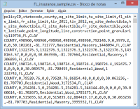

# Server Side - Parte 7

---
# Roteiro

1. Arquitetura baseada em serviços (SOA)
1. _Web Services_
  - Arquitetura SOAP
  - Arquiteturas REST
1. Organização de código em 3 camadas: **MVC**

---
# _Service-Oriented Architecture_ (SOA)

---
## Evolução da **arquitetura de _software_**


---
## Contexto de surgimento da SOA

- Organizações passam a **informatizar seus processos**
  - Isso foi feito **de forma gradativa**, ao longo dos anos
- Os sistemas adotados podiam usar **bancos de dados diferentes** e 
  funcionar em **plataformas distintas**
  - Como fazer para integrá-los?
    - 
      Uma forma muito usada (até hoje), porém horrível: 
      **exportação/importação de arquivo de texto** entre um 
      sistema e outro

---
## Abordagens de integração entre sistemas

- Surgiram algumas formas de integração e organização de sistemas
  - <abbr title="Remote Procedure Call">RPC</abbr>
    - Execução de um procedimento arbitrário em um computador remoto
  - <abbr title="Common Object Request Broker Architecture">CORBA</abbr>
    - Interfaces dos sistemas definidas numa linguagem específica (<abbr title="Interface Definition Language">IDL</abbr>)
  - <abbr title="Distributed Component Object Model">DCOM</abbr>
    - Baseado em COM (comunicação entre processos), porém distribuído em rede 
  - **Web services**
   
---
# _Web Services_

---
## Contexto
  
- Durante a forte ascenção da Web (meados da década de 90), vários processos
  manuais passaram a ser realizados online:
  - Emissão de _vouchers_ (_e.g._, passagem, tickets)
  - Rastreamento de processos (_e.g._, correios)
  - Divulgação de informação (_e.g._, previsão do tempo)
- Foi necessário criar um arcabouço de ferramentas que automatizasse a disponibilização 
  desses processos
- Tais ferramentas deveriam ser **interoperáveis** e **escaláveis** para 
  promover o reuso dos sistemas existentes **remotamente**

---
## O que é um _web service_?

- Um **serviço** disponibiliza uma interface para clientes invocarem 
  seus métodos remotamente
- Um serviço web (_web service_) é um **serviço** cuja interface está disponibilizado 
  usando a **mesma _stack_ de tecnologia da www**
  - Protocolo HTTP, TCP/IP
  - Servidores _web_
  - Formatos XML e/ou JSON
- A W3C especificou [o que é um _web service_](http://www.w3.org/TR/2004/NOTE-ws-arch-20040211/) em 2004

---
## **Benefícios** de ser _web_

- Independência de:
  - Linguagem de programação
  - Sistema operacional
  - Rede (topologia)
- Uso do HTTP:
  - Estável
  - Simples
  - Escalável

---
## Duas principais "classes" de _web services_

- _Web services_ **arbitrários** (1996)
  - O serviço pode expor um conjunto arbitrário de operações
- _Web services_ compatíveis com **REST** (2000)
  - O serviço pode expor apenas um conjunto de operações _stateless_ sobre os recursos 

---
## _Web services_ arbitrários

- Usam um conjunto de tecnologias para 
- <abbr title="Simple Object Access Protocol">**SOAP**</abbr>
  - Protocolo de comunicação entre serviços expostos via Web (explicado a seguir)

---
## Exemplo de mensagens SOAP (invocação)

```xml
GET /weather HTTP/1.1
Host: api.climatempo.com.br
Content-Type: application/soap+xml; charset=utf-8
Content-Length: 295
 
<?xml version="1.0"?>
<soap:Envelope
  xmlns:soap="http://www.w3.org/2001/12/soap-envelope"
  soap:encodingStyle="http://www.w3.org/2001/12/soap-encoding">
  <soap:Header>
  </soap:Header>
  <soap:Body xmlns:m="http://api.climatempo.com.br/weather">
    <m:GetTemperature>
      <m:Location>Igarapé</m:Location>
    </m:GetTemperature>
  </soap:Body>
</soap:Envelope>
```

---
## Exemplo de mensagens SOAP (resposta)

```xml
HTTP/1.1 200 OK
Content-Type: application/soap+xml; charset=utf-8
Content-Length: 319

<?xml version="1.0"?>
<soap:Envelope
  xmlns:soap="http://www.w3.org/2001/12/soap-envelope"
  soap:encodingStyle="http://www.w3.org/2001/12/soap-encoding">

  <soap:Body xmlns:m="http://api.climatempo.com.br/weather">
    <m:GetTemperatureResponse>
      <m:Temperature>34.5</m:Temperature>
    </m:GetTemperatureResponse>
  </soap:Body>

</soap:Envelope>
```

---
# Organização em camadas: **MVC**

---
## a


